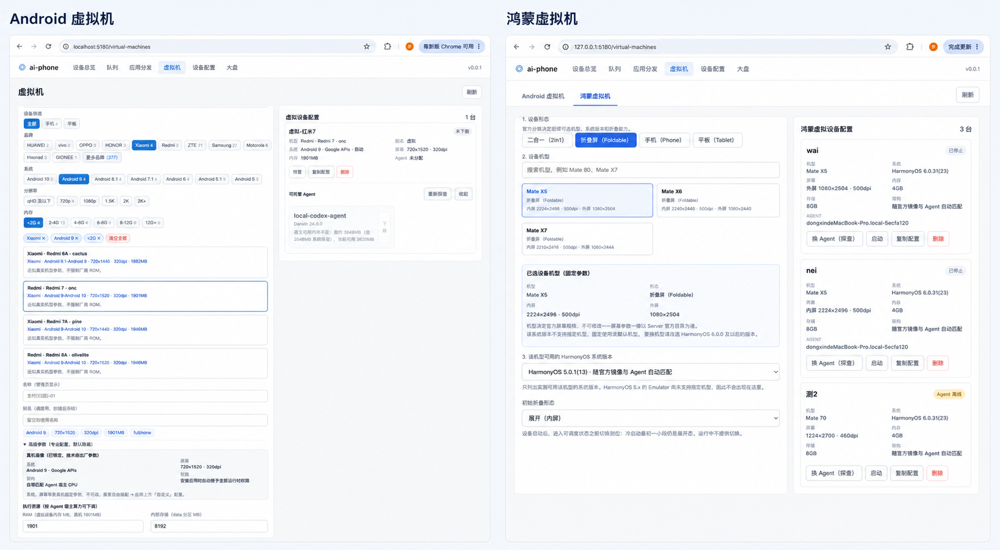
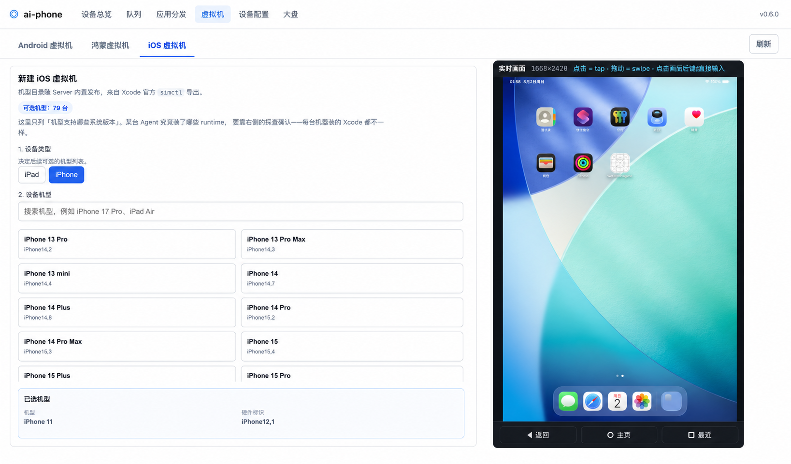
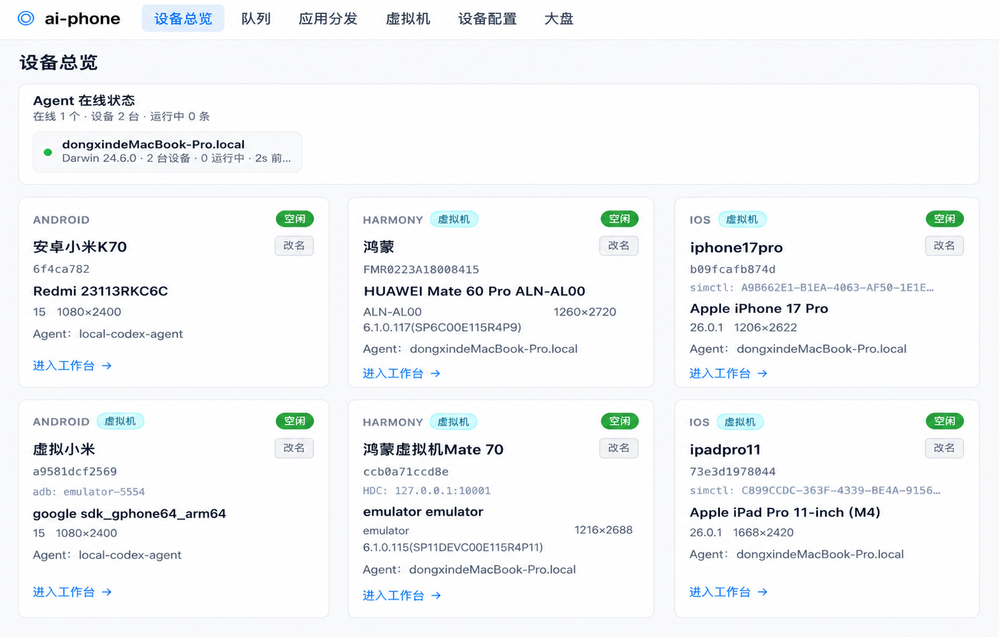

<p align="right">
  <a href="./README.md">简体中文</a> | English
</p>

# ai-phone

[](https://github.com/dongxinsuperman/ai-phone/actions/workflows/ci.yml)

<p align="center">
  
</p>

**ai-phone is an AI automation platform for physical and virtual devices across iOS, Android, and HarmonyOS.** It turns structured natural-language test cases into scheduled device runs, real-time execution logs, screenshots, self-contained HTML reports, and final callbacks.

It is designed for QA teams and internal platforms that want to move from brittle step scripts to AI-consumable test cases while keeping device scheduling, observability, and reporting under control.

## What It Does

- Accepts Markdown or API-submitted test cases with title, preconditions, steps, and expected result.
- Dispatches test items through a multi-device queue across iOS, Android, and HarmonyOS.
- Executes goals with a built-in VLM visual decision loop, without relying on DOM, XPath, or accessibility trees.
- Adds guardrails around the model loop: page stability checks, stuck detection, audit model review, final assertion, trajectory cache, and transient UI gates.
- Produces self-contained HTML reports with before/after screenshots, step logs, model thoughts, token usage, and final status.
- Supports optional execution engines, including the bundled VLM runner and the Midscene bridge.
- Manages iOS, Android, and HarmonyOS virtual devices on `main`, so teams can scale device supply without relying only on physical-device procurement.

## Why It Is Different

Most mobile automation stacks start from selectors or hard-coded scripts. ai-phone starts from a test goal and treats the phone screen as the source of truth. The execution layer is still operationally strict: it owns queueing, device locks, readiness gates, reports, callbacks, and recovery paths.

In practice, this means an upstream system can generate a test case like "Open Settings and verify the About page", then ai-phone handles device allocation, visual execution, reporting, and final result delivery.

## Core Capabilities

| Area | Capability |
|---|---|
| Platforms | iOS, Android, HarmonyOS |
| Execution | Natural-language goals, pure visual decision loop, optional third-party engines |
| Scheduling | Submission queue, device alias pools, device locks, TTL recovery |
| Reports | Self-contained HTML reports, before/after screenshots, token statistics |
| Observability | Device dashboard, queue dashboard, analytics page, AI summary |
| Stability | Page-stability waits, local stuck detection, audit model, final assertion |
| Reuse | Trajectory cache modes `off`, `v1`, `v2`, `v3` |
| Scaling | iOS, Android, and HarmonyOS virtual-device lifecycle management on `main` |
| Distribution | APK / HAP / IPA plus iOS Simulator `.app` / `.zip` artifacts, with batch install |
| License | MIT License |

## Branches

`main` is the recommended branch. It uses the Distributed Agent Brain architecture and receives new major features first, including virtual-device management across iOS, Android, and HarmonyOS.

`next/server-brain` is still maintained for teams that require the model decision loop and model credentials to stay centralized on the server. It may not include every new feature from `main`.

## Why Virtual Devices Matter

ai-phone brings physical and virtual devices from iOS, Android, and HarmonyOS into the same device pool. Virtual devices are not about making one device execute faster. They are about making device supply scale with test concurrency.



**Test duration is determined by concurrency, not script efficiency.** If 100 test cases are assigned to 100 devices, wall-clock time approaches the duration of the slowest case rather than the sum of all 100. A workload that used to grow linearly with demand becomes close to constant-time when device supply scales with it.

Concurrency requires enough devices to run at the same time. One physical device can execute only one task at a time, and an identical physical model, OS version, and configuration cannot be copied on demand. A virtual-device configuration can be replicated, moving capacity growth from hardware procurement to available compute resources.



**Virtual devices do not introduce a new architecture; they only remove the device-supply ceiling.** ai-phone already runs an Agent on each computer and aggregates attached devices into a shared pool. After virtual devices join, task submission, device locking, the workbench, natural-language execution, logs, reports, and result delivery remain unchanged. The only difference is that device supply expands from “how many phones are on hand” to “how many virtual devices the available computers can run.”



Physical and virtual devices share the same execution path, while the external platform model remains iOS, Android, and HarmonyOS. Host preparation is documented in [Android virtual-device Agent setup](./docs/agent-vm-env-setup（Agent虚拟机环境准备）.md), [iOS virtual-device Agent setup](<./docs/agent-ios-sim-vm-env-setup（Agent iOS虚拟机环境准备）.md>), and [HarmonyOS virtual-device Agent setup](./docs/agent-harmony-vm-env-setup（Agent鸿蒙虚拟机环境准备）.md).

## Quick Start

```bash
git clone https://github.com/dongxinsuperman/ai-phone.git
cd ai-phone/backend
cp .env.example .env  # Fill DB, agent token, PHONE_VLM/AUX, and local Agent/WDA values.
python3.11 -m venv .venv
source .venv/bin/activate
pip install -e .

# Terminal A: server
uvicorn ai_phone.server.app:app --host 0.0.0.0 --port 8000 --reload

# Terminal B: local agent
python -m ai_phone agent

# Terminal C: web UI
cd ../web
npm install
npm run dev
```

Config file roles:

```text
backend/.env.defaults      runtime defaults committed with the project
backend/.env.example       fill-in guide copied to .env
backend/.env.full.example  full advanced reference; not loaded at runtime
backend/.env               real deployment config; not committed
backend/.env.local         local machine override; not committed
```

Open <http://127.0.0.1:5180>, choose a device, enter a natural-language goal, and watch the run.

For a full new-Mac setup, including iOS, Android, HarmonyOS, environment variables, and troubleshooting, see the Chinese deployment guide:

- [deployment-from-zero](./docs/deployment-from-zero（从0到1部署指南）.md)

## Submit A Test Case

```bash
curl -X POST http://localhost:8000/api/submissions \
  -H 'Content-Type: application/json' \
  -d '{
    "submissionName": "demo-smoke",
    "functionMapContext": "Optional: Settings has an About entry",
    "items": [
      {
        "caseId": "demo_001",
        "platforms": ["android"],
        "functionMapContext": "Optional item-specific reference: About is near the bottom",
        "runContent": "Open Settings and enter the About page"
      }
    ]
  }'
```

`functionMapContext` is optional: without it, the agent still executes through the full
task + substeps + current-screenshot path. When supplied, it is treated as caller-selected,
high-weight business execution context for page relationships, concrete objects, paths,
test data, and business terms. The raw Map is injected once in the first User message of
each logical model session segment—not in the System prompt or HTML report—and it cannot
add tasks, skip substeps, or change completion conditions.

Full API details are in:

- [external-api](./docs/external-api（对外调用清单）.md)

## Documentation

Most detailed documents are currently written in Chinese, but the file names and code examples are still useful for implementation work.

| Document | Purpose |
|---|---|
| [Chinese README](./README.md) | Full project overview |
| [product-boundaries](./docs/product-boundaries（产品边界）.md) | Product scope and integration boundary |
| [features](./docs/features（使用功能介绍）.md) | Feature manual |
| [external-api](./docs/external-api（对外调用清单）.md) | Submission API, query API, callback format |
| [getting-started](./docs/getting-started（本地开发指南）.md) | Local development setup |
| [agent-deployment](./docs/agent-deployment（Agent接入部署指南）.md) | Agent machine setup |
| [ios-setup](./docs/ios-setup（iOS接入指南）.md) | iOS device setup |
| [harmony-setup](./docs/harmony-setup（HarmonyOS接入指南）.md) | HarmonyOS setup |
| [trajectory-cache-usage](./docs/trajectory-cache-usage（轨迹缓存使用文档）.md) | Trajectory cache modes and risk boundaries |
| [agent-vm-env-setup](./docs/agent-vm-env-setup（Agent虚拟机环境准备）.md) | Android Emulator host preparation |
| [agent-ios-sim-vm-env-setup](<./docs/agent-ios-sim-vm-env-setup（Agent iOS虚拟机环境准备）.md>) | iOS Simulator host preparation |
| [agent-harmony-vm-env-setup](./docs/agent-harmony-vm-env-setup（Agent鸿蒙虚拟机环境准备）.md) | HarmonyOS Emulator host preparation |
| [harmony-vm-architecture](./docs/harmony-vm-architecture（鸿蒙虚拟机当前架构与演进规划）.md) | Current Agent GUI limits, direct migration to official headless, and the planned Linux gRPC pool |

## License

ai-phone is released under the [MIT License](./LICENSE). Bundled and optional third-party components remain under their own upstream licenses; see [Third-Party Notices](./THIRD_PARTY_NOTICES.md).
