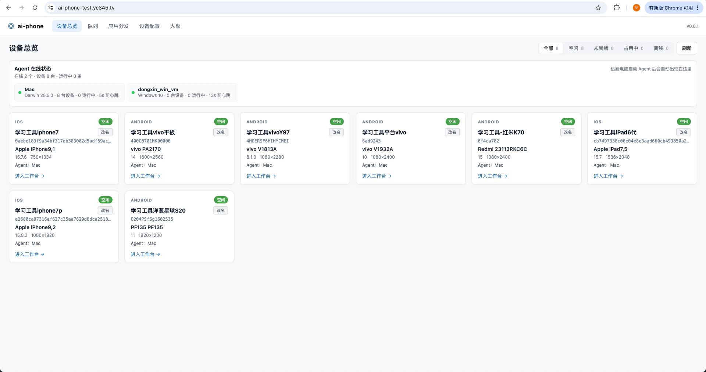
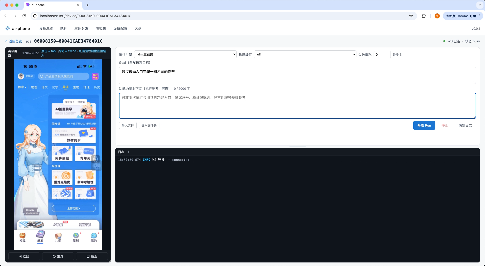
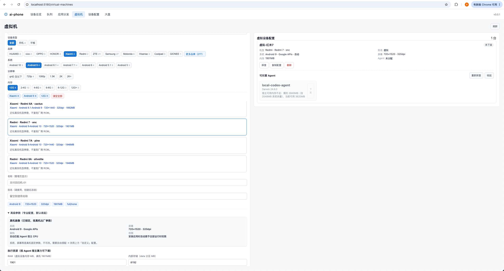
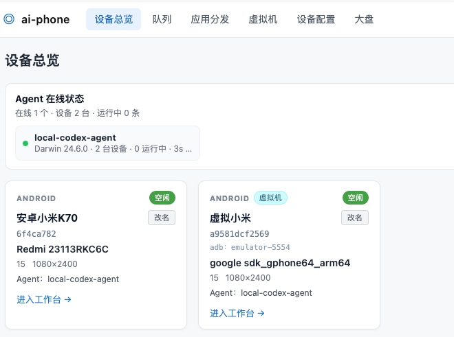
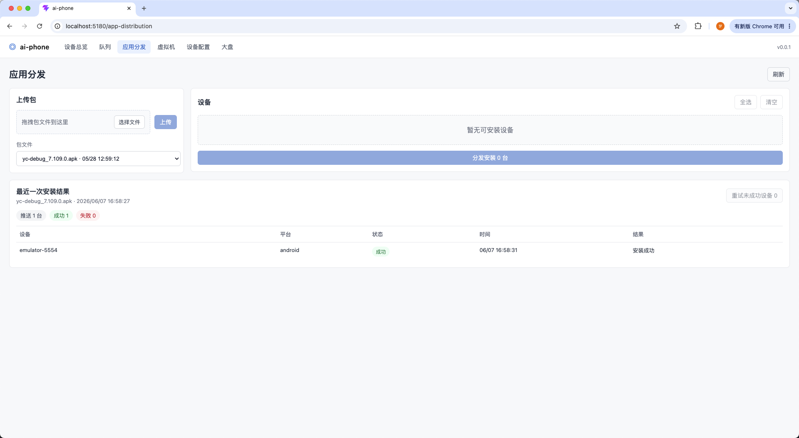

# ai-phone

[](https://github.com/dongxinsuperman/ai-phone/actions/workflows/ci.yml)

**面向中小型公司的三端真机 AI 自动化中台** —— iOS / Android / HarmonyOS 同级原生支持，自然语言驱动的纯视觉决策，开箱即用的调度队列与多设备并发，执行器可插拔，一台 Mac 即可起完整链路。新 Mac 从 0 到 1 的完整部署见 [deployment-from-zero（从0到1部署指南）](./docs/deployment-from-zero（从0到1部署指南）.md)。

> **产品形态**：ai-phone 不是一个执行器 SDK，而是把"投递批次 → 设备池调度 → 自然语言执行 → 终态广播 + HTML 报告 + 大盘统计"做成 QA 团队 / 业务回归大盘开箱即用的中台能力。**执行器是其中一个可替换组件**：默认内置自研的 VLM 纯视觉决策循环，并在外层包了页面稳定、卡死检测、审判、断言、状态路标、瞬态 UI 处理等执行安全层；也可挂载第三方执行器作为额外引擎选项。

> **产品边界与出发点**：ai-phone 不是孤立的“点手机工具”，也不是测试平台本身，而是 AI 测试链路里的真机执行层。上游可以由 Cursor、CI、内部平台或 AI 助手生成可消费测试 case，下游由 ai-phone 把这些自然语言 case 投递到真实 iOS / Android / HarmonyOS 设备上执行，并回传截图、日志、报告和终态结果。详细说明见 [product-boundaries（产品边界）](./docs/product-boundaries（产品边界）.md)。

---

## 看一眼实际样子



按"调度 → 调试 → 决策护城河 → 产出 → 观测"5 个节点串起来看：

**1. 调度队列** —— 三端独立 FIFO + 正在执行 + 最近批次状态一栏拉通，外部投递的 Submission 实时分发到设备池：


**2. 单设备调试** —— 浏览器即客户端：左实时画面（scrcpy / WDA / hypium 三端原生推流）、右自然语言 Goal 输入 + 步骤日志面板，回写通道与 VLM 共用，业务测试同学零安装、零配置：



**3. 辅助系统护城河** —— ai-phone 不是把截图直接交给 VLM 赌下一步，而是在执行外层加了一套可监督的安全层：页面稳定后再决策，本地 pHash 捕捉同坐标 / 同屏 / 滑动震荡，异常自动召唤审判系统，终局用 before / after 双图断言。轨迹缓存回放还会用 V2 状态路标对齐页面、V3 意图回放重新定位控件，并把非业务瞬态弹窗标记为 optional gate，避免"首跑关弹窗"污染后续复跑。


> 完整辅助能力（页面稳定 / 通道判定 / 卡死检测 / 审判 / 断言 / 状态路标 / 瞬态弹窗 gate）见 [辅助系统核心逻辑及效果](./docs/assistant-systems（辅助系统核心逻辑及效果）.md)。

**4. 自包含 HTML 报告** —— 单 case 与三端汇总两级，每步操作前 / 操作后双图对照 + Token 统计 + VLM 思考全留痕，零外部依赖、匿名可访问，便于外部平台直接嵌入：


**5. 运维大盘** —— 吞吐 / 设备健康 / Token 用量 / 稳定性四象限一页呈现；AI 分析卡片基于当日数据生成 4 段中文总结，跟随 `ASSISTANT_BACKEND` 在豆包 / Claude / GPT 间自由切换：


**6. 不依赖真机的虚拟机扩容（`main` 独有）** —— 「虚拟机」页按品牌 / 机型 / 系统 / 分辨率挑选机型并下发到 Agent，自动建 AVD 启动；起来后带 `virtual` 标识进入设备池，与真机同池、复用真机同一条调度与执行链路：





**7. 应用分发（三端通用）** —— 上传 APK / HAP / IPA 包（Android / HarmonyOS / iOS 三端），按平台筛出可分发设备，一键批量安装到设备池，实时回传每台安装结果、支持失败重试：



---

## 为什么选 ai-phone

| 能力维度 | ai-phone 提供的 |
|---|---|
| **三端真机原生** | iOS（WDA / mjpeg passthrough）/ Android（adb + scrcpy）/ HarmonyOS（hdc + hypium）三端等价。鸿蒙作为一等公民与 iOS / Android 同等支持，在开源生态里少见 |
| **调度队列 + 多设备并发** | `POST /api/submissions` 投递批次 → 实时按 `device_alias_pool` 分发到设备池 → Submission / Item TTL 兜底超时 → Kafka / Webhook 双通道终态广播 → HTML 报告自动落盘。设备占用锁 + readiness gate 防止派单到僵尸设备 |
| **自然语言驱动** | `runContent: "打开设置并进入关于本机"` 直接喂给 VLM，不写 selector / xpath / 步骤脚本 |
| **纯视觉决策** | 每步只看截图，不依赖 DOM / 控件树 / 无障碍服务，跨 App 跨平台不挑食 |
| **辅助系统护城河** | 页面稳定后再决策；本地 pHash 卡死检测不烧 token；同坐标 / 同屏 / 震荡滑动自动召唤独立审判；before / after + 全步骤上下文做终局断言；结构化 / 自由对话自动分流 —— "VLM 是否真生效"不再是黑盒 |
| **可监督轨迹缓存** | V1 固定动作回放、V2 状态路标对齐、V3 意图回放重定位；缓存复跑后仍走最终断言，失败会清理或标记可疑缓存；非业务瞬态弹窗可标记为 optional gate，当前没有同类弹窗时跳过，有同类弹窗时按需执行或修复 |
| **三家协议自由组合** | 主 VLM 走 Doubao / Claude / GPT 三选一，辅助系统也可异家组合（如"主 Claude + 辅 Doubao 省成本"），全部走 env 切换、零代码改动 |
| **执行器可插拔** | 默认内置自研 VLM 决策循环；前端"引擎"下拉框允许挂载第三方执行器作为额外选项，调度 / 报告 / 设备池 / 终态广播仍然走中台统一链路 |
| **虚拟机（Android Emulator）** | 「虚拟机」页按品牌 / 机型 / 系统 / 分辨率挑选，自动建 AVD 下发到 Agent 启动；起来后作为普通 android 设备进设备池，复用真机同一条调度与执行链路。**不依赖真机即可扩容**（`main` 独有能力） |
| **应用分发（三端）** | 上传 APK / HAP / IPA 包（Android / HarmonyOS / iOS 三端），按平台自动筛出可分发设备，一键批量安装到设备池，实时回传每台安装结果，支持失败重试与超时兜底 |
| **黑屏待机** | 三端支持空闲自然息屏省电，Run 前由 preflight 唤醒（Android `wake + dismiss-keyguard` / iOS `wda.unlock` / HarmonyOS `wake + 按需上滑`）；息屏态仍可派发 |
| **快速部署** | 一台 Mac + Postgres + 一根数据线即可起完整链路；生产部署模板在 Roadmap 中持续补齐 |

**典型用户**：

- 中小型公司 QA 团队 —— 真机上做 AI 化的兼容性 / 回归 / 冒烟测试
- 业务回归大盘想从"脚本维护"切到"自然语言投递"
- 海外团队需要切 Claude / GPT 跑英文 App（改两个 env 即用）

---

## 分支说明

ai-phone 有两条同源、并行维护的架构线，底层架构区别在「VLM 决策执行脑放在哪」。两者**核心数据库 schema 与基础产品能力（三端 driver、调度队列、缓存 V1/V2/V3、报告、大盘、辅助安全层）兼容**；但**新增大功能优先（或仅）落地 `main`，两条线的功能完整度正在拉开** —— `main` 是推荐主线。

> ⚠️ **两条线并非功能对等**：像 **Android 虚拟机** 这类较新的大功能是 **`main` 独有、暂不同步 `next/server-brain`**。`next` 仍在维护、可继续使用，但会逐步落后于 `main`。**新接入请直接用 `main`。**

| | `main`（默认主线） | `next/server-brain` |
|---|---|---|
| 架构 | **Distributed Agent Brain（分布式 Agent 大脑）** | **Server Brain（Server 大脑）** |
| 执行脑 | VLM 决策循环在 **Agent 本地** 跑 | VLM 决策集中在 **Server** 跑 |
| 配置 / 密钥 | Server 集中下发，Agent 不常驻模型密钥 | Server 集中持有 |
| 缓存 V1/V2/V3 | Agent 本地回放 + 第一手归档回传，Server 薄存储 | Server 集中回放 + 归档 |
| **独有大功能** | ✅ **Android 虚拟机（Emulator）**，后续大功能优先落地 | ⚠️ 暂不同步 `main` 的新增大功能，逐步落后 |
| 适合 | 多 Agent 分布执行、就近决策、Agent 侧算力可用、**需要虚拟机扩容** | 合规要求 Agent 不得持有模型出口、强集中管控 / 审计 |

> **怎么选**：默认用 `main`（分布式 Agent 大脑，最新主线）。需要 **Android 虚拟机等 `main` 独有能力**时只能用 `main`。仅当合规要求"Agent 不得持有模型能力、一切决策与密钥集中在 Server"时才选 `next/server-brain`。两条线**二选一部署**。

> **怎么迁移（同库）**：两条线**数据库 schema 向前兼容**，`next/server-brain` 用户备份后可**同库增量升级**到 `main`，不需要新建库。**但同一时间只让一个架构连同一套库跑**（别让两个服务同时写一个库，会互相抢任务 / 覆盖设备池）。

> **历史**：现在的 `main` 与老 `main`（Agent 大脑 v0.1.x 轻量版）同属 Agent 脑血脉，是它的现代化升级（执行脑仍在 Agent，新增 Server 集中配置 / 密钥 / 缓存薄管控）；v0.1.x 历史快照见 tag `archive/main-frozen-2026-05-30`。

> **未来**：计划用配置开关把"Agent 脑 / Server 脑"两种执行模式统一回单一 `main`，届时 `next/server-brain` 合回主线。不过这只是当前计划，最终会参考多数用户的选择：如果 `next` 的使用者很少、或没有强需求，它也可能不再合回，而是直接被舍弃。

> **轨迹缓存说明**：两条线都具备 VLM 成功轨迹缓存 / 回放能力，支持 `off` / `v1` / `v2` / `v3` 四种投递模式。轨迹回放对 case 的起跑状态、账号状态、设备状态、业务页面稳定性要求很高，建议只在业务起跑状态高度可控、重复执行稳定后按场景打开。用法见 [trajectory-cache-usage（轨迹缓存使用文档）](./docs/trajectory-cache-usage（轨迹缓存使用文档）.md)。

架构细节：`main` 主线见 [agent-brain（分布式Agent大脑架构说明）](./docs/agent-brain（分布式Agent大脑架构说明）.md)；Server 大脑线见 [server-brain（Server大脑架构说明）](./docs/server-brain（Server大脑架构说明）.md)。

---

## 30 秒上手

```bash
git clone https://github.com/dongxinsuperman/ai-phone.git
cd ai-phone/backend
cp .env.example .env  # 至少填 AI_PHONE_DB_URL + AI_PHONE_VLM_API_KEY
python3.11 -m venv .venv && source .venv/bin/activate && pip install -e .

# 终端 A：起 Server
uvicorn ai_phone.server.app:app --host 0.0.0.0 --port 8000 --reload

# 终端 B：起 Agent（接真机；本机开发可不传 server/token，走 .env）
python -m ai_phone agent
# 远端办公区电脑接入公司 Server 时：
# python -m ai_phone agent --server http://<server-host>:8000 --token <AI_PHONE_AGENT_TOKEN>

# 终端 C：起前端
cd ../web && npm install && npm run dev
```

打开 <http://127.0.0.1:5180> → 选设备 → 进工作台 → 输入自然语言 goal → 看 VLM 跑。

> 新 Mac 从 0 到 1 完备部署请看 [deployment-from-zero（从0到1部署指南）](./docs/deployment-from-zero（从0到1部署指南）.md)。
> 详细前置 / 数据库 / 调试参数请看 [getting-started（本地开发指南）](./docs/getting-started（本地开发指南）.md)。
> iOS / HarmonyOS 接入需要额外配置，见 [ios-setup（iOS接入指南）](./docs/ios-setup（iOS接入指南）.md) 与 [harmony-setup（HarmonyOS接入指南）](./docs/harmony-setup（HarmonyOS接入指南）.md)。

---

## 投递一条 case（最小示范）

```bash
curl -X POST http://localhost:8000/api/submissions \
  -H 'Content-Type: application/json' \
  -d '{
    "submissionName": "demo-smoke",
    "functionMapContext": "可选：设置首页有“关于本机”入口",
    "items": [
      {
        "caseId": "demo_001",
        "platforms": ["android"],
        "runContent": "打开设置并进入关于本机"
      }
    ]
  }'
```

完整字段、错误码、Kafka / Webhook 回调格式见 [对外调用清单](./docs/external-api（对外调用清单）.md)。

### 让 case 跑得更稳

AI PHONE 可以直接执行一句自然语言目标；但如果你要做业务回归、兼容性测试或批量投递，`runContent` 建议写成 **AI 可消费测试用例**：`测试标题 / 前置条件 / 操作步骤 / 预期结果` 四字段自洽，步骤单线，预期只保留一个核心断言。

简短理解：case 不是写给人类 QA 补全上下文的提纲，而是写给 AI 执行器跑到底的脚本。

写法指南见 [AI 可消费测试用例指南](./docs/ai-consumable-test-cases（AI可消费测试用例指南）.md)，完整方法论与 baseline skill 见 [ai-executable-case-pattern](https://github.com/dongxinsuperman/ai-executable-case-pattern)。

---

## 当前状态

| 模块 | 状态 |
|---|---|
| 三端真机 driver + 镜像（iOS / Android / HarmonyOS） | ✅ 完整 |
| 调度队列 + 设备池（Submission / Item TTL / 别名 / 锁 / readiness gate） | ✅ 完整 |
| 终态广播（Kafka / Webhook / stdout 三选一） | ✅ 完整 |
| 自包含 HTML 报告 + 运维大盘 | ✅ 完整 |
| VLM 决策循环 + 执行安全层（页面稳定 / 卡死 / 审判 / 断言 / 状态路标 / 瞬态 UI gate） | ✅ 完整 |
| 多协议适配（Doubao / Claude / GPT 自由组合） | ✅ 完整 |
| 执行器可插拔（内置 VLM + Midscene 桥接） | ✅ 完整 |
| Android 虚拟机（Emulator）接入 + 全生命周期管理（`main` 独有） | ✅ 完整 |
| 应用分发（上传包 / 批量安装 / 失败重试 / 超时兜底） | ✅ 完整 |
| 黑屏待机（三端空闲息屏 + Run 前唤醒，息屏态可派发） | ✅ 完整 |

## Roadmap

- 双架构统一：用配置开关统一「Agent 脑（`main`）/ Server 脑（`next/server-brain`）」两种执行模式，逐步把 `next/server-brain` 合回单一 `main`
- Server 多 Pod 化（M6）：Redis + 共享存储 + 分布式锁 / 调度 lease，支持多副本横向扩展（当前单 Pod 已满足，按需推进）
- 历史回放页 / Case 加载对话框：API 就位，前端待补
- 日志服务系统：统一收集、检索、保留策略
- 生产部署模板：Docker Compose / K8s / Nginx / Ingress 示例
- Webhook 安全增强：当前已支持 `callbackUrl` 终态回调，后续补公网集成的 HMAC 签名 / 验签示例

---

## 维护与协作

ai-phone 采用 **GNU GPLv3** 开源。Copyright (C) 2026 Dongxin and ai-phone contributors。官方默认主线是 `main`（分布式 Agent 大脑），新功能优先落地 `main`；`next/server-brain`（Server 大脑）作为并行架构线持续维护，但部分大功能（如 Android 虚拟机）暂不同步。官方分支由原作者维护，是否采纳任何改动由维护者根据项目方向、稳定性和维护成本决定。

协作上优先使用 Issues / Discussions 交流问题、场景和设计取舍。Pull Request 可以提交，但不承诺 review、响应时效或合并；PR 更适合作为 bug 报告、设计参考或候选补丁。

欢迎 fork 后按自己的节奏二次开发和长期维护分支。基于本项目修改、分发或提供第三方版本时，必须继续遵守 GPLv3 的开源要求，并保留原始 LICENSE、来源说明与第三方声明。

第三方版本不得冒充 ai-phone 官方版本，不得使用容易让用户误认为由原作者维护、发布或背书的名称、说明、徽标、发布渠道或版本标识。

---

## 文档导航

| 文档 | 受众 | 内容 |
|---|---|---|
| [product-boundaries（产品边界）](./docs/product-boundaries（产品边界）.md) | 讨论者 / 集成方 / 二次开发者 | 项目出发点、产品边界，以及它和 AI 生成 case / CI / 测试平台的关系 |
| [CHANGELOG](./CHANGELOG.md) | 部署者 / 维护者 | 影响部署、接入和排障口径的版本变化记录 |
| [features（使用功能介绍）](./docs/features（使用功能介绍）.md) | 调用方 / 业务同学 | 产品手册：设备、队列、工作台、报告、大盘、稳定策略 |
| [external-api（对外调用清单）](./docs/external-api（对外调用清单）.md) | 调用方 / CI 集成 | 当前 API 契约：投递 / 查询 / 取消 / Kafka / Webhook 完整字段 |
| [ai-consumable-test-cases（AI可消费测试用例指南）](./docs/ai-consumable-test-cases（AI可消费测试用例指南）.md) | 调用方 / QA / AI 助手 | 如何把 `runContent` 写成更适合 AI PHONE 执行的四字段 case |
| [architecture（架构设计）](./docs/architecture（架构设计）.md) | 二次开发者 | 系统架构：调度、三端链路、数据模型、终态广播（两条架构线的公共基座） |
| [agent-brain（分布式Agent大脑架构说明）](./docs/agent-brain（分布式Agent大脑架构说明）.md) | 二次开发者 | `main` 主线：执行脑下沉 Agent、配置 / 密钥集中下发、缓存 Agent 本地回放 + Server 薄存储 |
| [server-brain（Server大脑架构说明）](./docs/server-brain（Server大脑架构说明）.md) | 二次开发者 | `next/server-brain` 线：Server 集中决策 / 回放 / 归档 |
| [deployment-from-zero（从0到1部署指南）](./docs/deployment-from-zero（从0到1部署指南）.md) | 部署者 / AI 助手 | 新 Mac 从 clone 到 Android / iOS / HarmonyOS 三端可执行的完整步骤、终端清单、自检和故障处理 |
| [agent-deployment（Agent接入部署指南）](./docs/agent-deployment（Agent接入部署指南）.md) | 接机同事 / Agent 部署者 | 只部署 Agent 机器时需要的依赖、Server 连接、三端手机准备、启动命令和验收标准 |
| [getting-started（本地开发指南）](./docs/getting-started（本地开发指南）.md) | 本地开发者 | 起后端 / 起 agent / 起前端、env 配置详解、FAQ |
| [trajectory-cache-usage（轨迹缓存使用文档）](./docs/trajectory-cache-usage（轨迹缓存使用文档）.md) | 调用方 / 部署者 | `cacheMode=off/v1/v2/v3` 使用方式、状态路标、风险边界、推荐组合 |
| [ios-setup（iOS接入指南）](./docs/ios-setup（iOS接入指南）.md) | iOS 接入者 | WDA / pmd3 / Xcode 自动续签 / iOS 17+ tunneld 按需流程 |
| [harmony-setup（HarmonyOS接入指南）](./docs/harmony-setup（HarmonyOS接入指南）.md) | 鸿蒙接入者 | hdc / hmdriver2 / hypium 镜像后端切换 |
| [android-vm-setup（安卓虚拟机接入与使用指南）](./docs/android-vm-setup（安卓虚拟机接入与使用指南）.md) | 虚拟机使用者 | `main` 独有：「虚拟机」页创建模拟器、机型 / 镜像口径、下发与生命周期 |
| [agent-vm-env-setup（Agent虚拟机环境准备）](./docs/agent-vm-env-setup（Agent虚拟机环境准备）.md) | Agent 部署者 | 跑 Android Emulator 的宿主环境准备（JDK / SDK / 镜像矩阵，含 Windows 专章） |
| [recommended-env（推荐部署Env清单）](./docs/recommended-env（推荐部署Env清单）.md) | 部署者 | iOS stable、Android/Harmony 黑屏待机推荐默认 |
| [assistant-systems（辅助系统核心逻辑及效果）](./docs/assistant-systems（辅助系统核心逻辑及效果）.md) | 算法调优者 | 执行安全层：页面稳定、通道判定、卡死检测、审判、断言、状态路标、瞬态 UI gate |
| [Midscene 执行器接入方案](./Midscene执行器接入方案.md) | 执行器扩展者 | 第三方执行器挂载方案 |
| [安全说明](./SECURITY.md) | 部署者 / 集成者 | 鉴权边界、默认 token、网络隔离和漏洞报告方式 |
| [贡献指南](./CONTRIBUTING.md) | 贡献者 | 本地开发、测试命令、PR 约定 |
| [第三方声明](./THIRD_PARTY_NOTICES.md) | 法务 / 维护者 | 捆绑组件与主要依赖的许可证说明 |

---

## 工程组成

- `backend/`：Python 3.11（`pyproject.toml` 锁 `>=3.11,<3.13`），同一个包按启动参数切换 Server / Agent 角色
- `web/`：Vue 3 + Vite 前端（**纯 JavaScript，无 TypeScript**）
- `midscene-bridge/`：第三方执行器桥接子工程（独立 Node 工程，按需启用）

> 发布源码包时建议使用 `git archive`，不要直接压缩本地工作目录；本地 `.env`、`.data/`、`node_modules/`、`dist/` 等运行产物都不应进入发布包。

---

## 致谢

三端能力栈站在巨人的肩膀上：

- [scrcpy](https://github.com/Genymobile/scrcpy)（Android 镜像）
- [WebDriverAgent](https://github.com/appium/WebDriverAgent)（iOS 控制）
- [pymobiledevice3](https://github.com/doronz88/pymobiledevice3)（iOS 设备服务 / DVT 兜底）
- [hmdriver2](https://github.com/codematrixer/hmdriver2)（HarmonyOS 控制）
- [adbutils](https://github.com/openatx/adbutils)（Android 控制）
