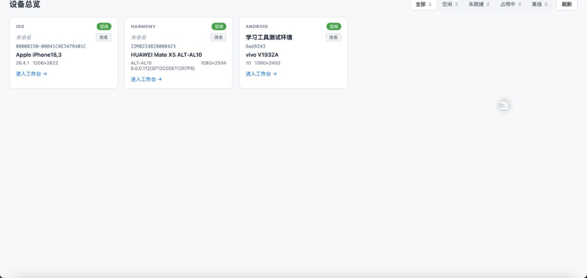
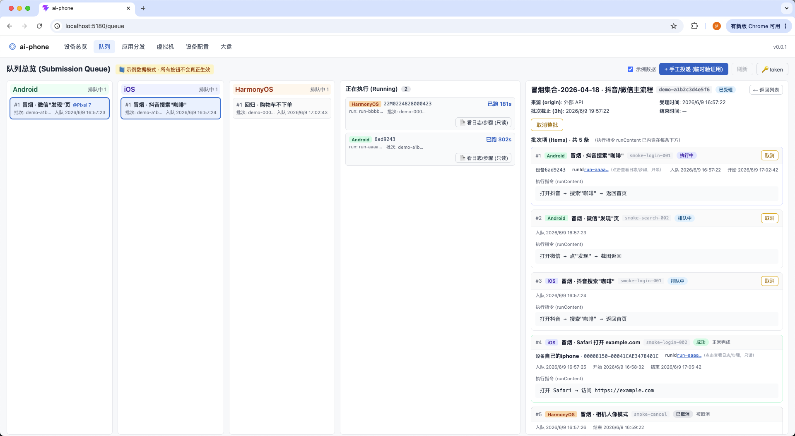
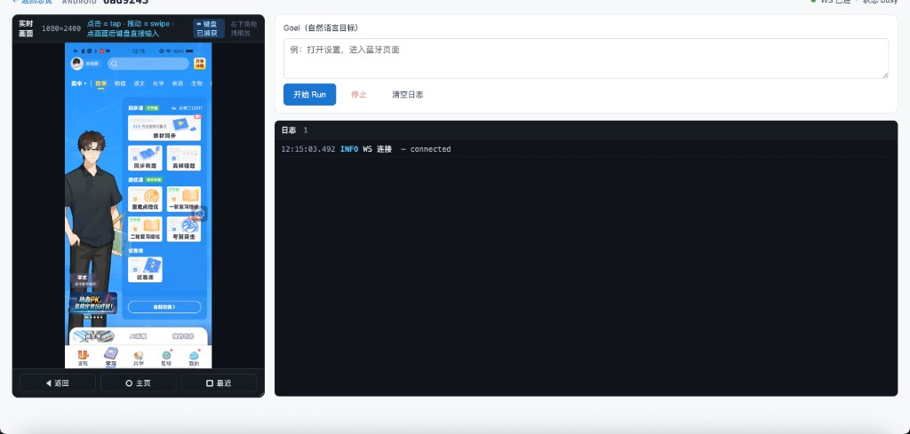
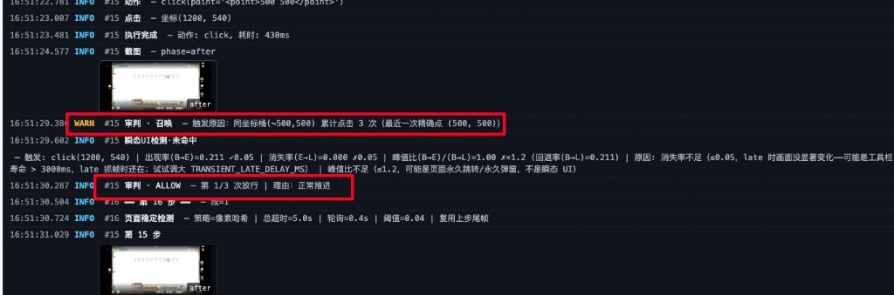
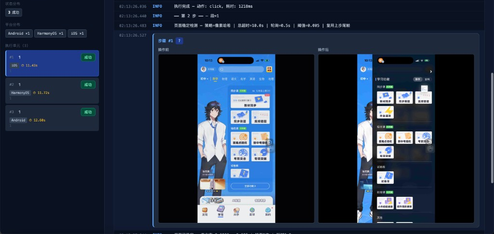
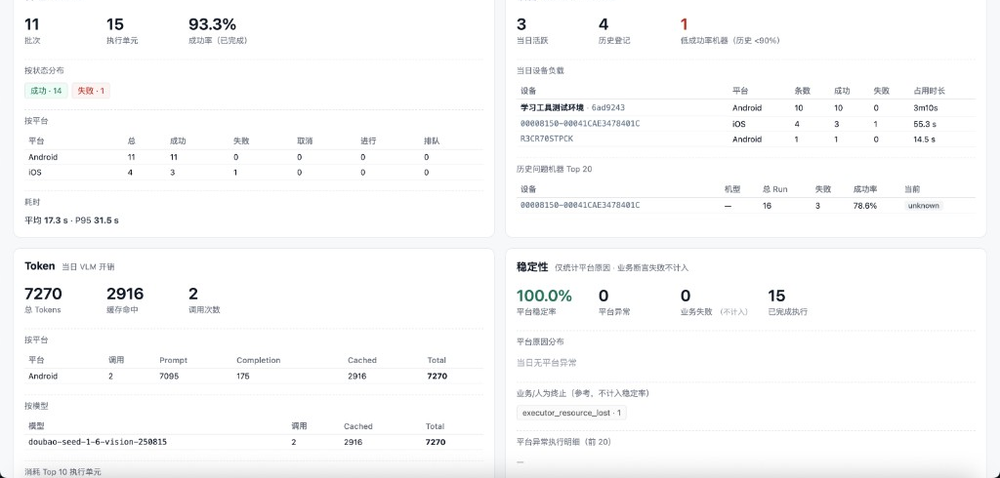

# ai-phone

[](https://github.com/dongxinsuperman/ai-phone/actions/workflows/ci.yml)

**面向中小型公司的三端真机 AI 自动化中台** —— iOS / Android / HarmonyOS 同级原生支持，自然语言驱动的纯视觉决策，开箱即用的调度队列与多设备并发，执行器可插拔，一台 Mac 即可起完整链路。

> **产品形态**：ai-phone 不是一个执行器 SDK，而是把"投递批次 → 设备池调度 → 自然语言执行 → 终态广播 + HTML 报告 + 大盘统计"做成 QA 团队 / 业务回归大盘开箱即用的中台能力。**执行器是其中一个可替换组件**：默认内置自研的 VLM 纯视觉决策循环（带卡死检测 / 审判 / 断言等辅助系统），也可挂载第三方执行器作为额外引擎选项。

---

## 分支说明

本分支 `next/server-brain` 为项目**长期主力分支**，采用 **Server 大脑，Agent 手脚** 的新架构：VLM 决策 / 轨迹缓存 / 断言 / 命令证据链集中在 Server，Agent 只执行设备动作，适合多办公区、多 Agent、统一模型密钥、统一调度报告、权限 / 审计 / K8s 化等生产化场景。

> 老的 `main` 分支为 **Agent 大脑架构** 的 v0.1.x 稳定版，自 2026-05 起已 **归档冻结**，仅接受 P0 级别 bugfix；新功能（轨迹缓存 V2/V3、Run 自动重跑、统一密钥/审计等）一律在本分支演进。两条分支不再做整体 merge —— 已是架构层面的不同选型。

> **轨迹缓存说明**：本分支已具备 VLM 成功轨迹缓存 / 回放能力（V1 稳定，V2 状态路标 + 恢复 VLM 已上线，V3 plan 缓存与在线识别陆续推进中）。轨迹回放对 case 的起跑状态、账号状态、设备状态、业务页面稳定性要求很高，建议先沉淀成功轨迹和日志，只在业务起跑状态高度可控、重复执行稳定后，再按场景打开回放。

本分支的部署和差异说明见 [Server 大脑架构说明](./docs/server-brain.md)。

---



---

## 为什么选 ai-phone

| 能力维度 | ai-phone 提供的 |
|---|---|
| **三端真机原生** | iOS（WDA / mjpeg passthrough）/ Android（adb + scrcpy）/ HarmonyOS（hdc + hypium）三端等价。鸿蒙作为一等公民与 iOS / Android 同等支持，在开源生态里少见 |
| **调度队列 + 多设备并发** | `POST /api/submissions` 投递批次 → 实时按 `device_alias_pool` 分发到设备池 → Submission / Item TTL 兜底超时 → Kafka / Webhook 双通道终态广播 → HTML 报告自动落盘。设备占用锁 + readiness gate 防止派单到僵尸设备 |
| **自然语言驱动** | `runContent: "打开设置并进入关于本机"` 直接喂给 VLM，不写 selector / xpath / 步骤脚本 |
| **纯视觉决策** | 每步只看截图，不依赖 DOM / 控件树 / 无障碍服务，跨 App 跨平台不挑食 |
| **辅助系统护城河** | 卡死检测（本地 pHash 算法层、不烧 token）+ 异常介入审判（独立轻量模型，反复同坐标 / 同屏 / 震荡滑动自动召唤）+ 双图断言系统（before / after + 全步骤上下文对照终局裁决）+ 通道判定（结构化 / 自由对话自动分流）—— "VLM 是否真生效"不再是黑盒 |
| **三家协议自由组合** | 主 VLM 走 Doubao / Claude / GPT 三选一，辅助系统也可异家组合（如"主 Claude + 辅 Doubao 省成本"），全部走 env 切换、零代码改动 |
| **执行器可插拔** | 默认内置自研 VLM 决策循环；前端"引擎"下拉框允许挂载第三方执行器作为额外选项，调度 / 报告 / 设备池 / 终态广播仍然走中台统一链路 |
| **快速部署** | 一台 Mac + Postgres + 一根数据线即可起完整链路；生产部署模板在 Roadmap 中持续补齐 |

**典型用户**：

- 中小型公司 QA 团队 —— 真机上做 AI 化的兼容性 / 回归 / 冒烟测试
- 业务回归大盘想从"脚本维护"切到"自然语言投递"
- 海外团队需要切 Claude / GPT 跑英文 App（改两个 env 即用）

---

## 看一眼实际样子

按"调度 → 调试 → 决策护城河 → 产出 → 观测"5 个节点串起来看：

**1. 调度队列** —— 三端独立 FIFO + 正在执行 + 最近批次状态一栏拉通，外部投递的 Submission 实时分发到设备池：



**2. 单设备调试** —— 浏览器即客户端：左实时画面（scrcpy / WDA / hypium 三端原生推流）、右自然语言 Goal 输入 + 步骤日志面板，回写通道与 VLM 共用，业务测试同学零安装、零配置：



**3. 辅助系统护城河** —— 同坐标 `(~500, 500)` 累计点击 3 次自动召唤审判系统（**WARN #15 审判·召唤**），独立轻量模型审视后决定继续推进还是 KILL，VLM 决策不再是黑盒（这是 ai-phone 与 Midscene 等 Plan-Loop 框架的根本差异）：



> 完整辅助能力（页面稳定 / 审判 / 断言 / 卡死检测 / 通道判定）见 [辅助系统核心逻辑及效果](./docs/assistant-systems（辅助系统核心逻辑及效果）.md)。

**4. 自包含 HTML 报告** —— 单 case 与三端汇总两级，每步操作前 / 操作后双图对照 + Token 统计 + VLM 思考全留痕，零外部依赖、匿名可访问，便于外部平台直接嵌入：



**5. 运维大盘** —— 吞吐 / 设备健康 / Token 用量 / 稳定性四象限一页呈现；AI 分析卡片基于当日数据生成 4 段中文总结，跟随 `ASSISTANT_BACKEND` 在豆包 / Claude / GPT 间自由切换：



---

## 30 秒上手

```bash
git clone https://github.com/dongxinsuperman/ai-phone.git
cd ai-phone/backend
cp .env.example .env  # 至少填 AI_PHONE_DB_URL + AI_PHONE_VLM_API_KEY
python3.11 -m venv .venv && source .venv/bin/activate && pip install -e .

# 终端 A：起 Server
uvicorn ai_phone.server.app:app --host 0.0.0.0 --port 8000 --reload

# 终端 B：起 Agent（接真机；本机开发可不传 server/token，走 .env）
python -m ai_phone agent
# 远端办公区电脑接入公司 Server 时：
# python -m ai_phone agent --server http://<server-host>:8000 --token <AI_PHONE_AGENT_TOKEN>

# 终端 C：起前端
cd ../web && npm install && npm run dev
```

打开 <http://127.0.0.1:5180> → 选设备 → 进工作台 → 输入自然语言 goal → 看 VLM 跑。

> 详细前置 / 数据库 / 调试参数请看 [本地开发指南](./docs/getting-started.md)。
> iOS / HarmonyOS 接入需要额外配置，见 [iOS 接入](./docs/ios-setup.md) 与 [HarmonyOS 接入](./docs/harmony-setup.md)。

---

## 投递一条 case（最小示范）

```bash
curl -X POST http://localhost:8000/api/submissions \
  -H 'Content-Type: application/json' \
  -d '{
    "submissionName": "demo-smoke",
    "items": [
      {
        "caseId": "demo_001",
        "platforms": ["android"],
        "runContent": "打开设置并进入关于本机"
      }
    ]
  }'
```

完整字段、错误码、Kafka / Webhook 回调格式见 [对外调用清单](./docs/external-api（对外调用清单）.md)。

---

## 当前状态

| 模块 | 状态 |
|---|---|
| 三端真机 driver + 镜像（iOS / Android / HarmonyOS） | ✅ 完整 |
| 调度队列 + 设备池（Submission / Item TTL / 别名 / 锁 / readiness gate） | ✅ 完整 |
| 终态广播（Kafka / Webhook / stdout 三选一） | ✅ 完整 |
| 自包含 HTML 报告 + 运维大盘 | ✅ 完整 |
| VLM 决策循环 + 辅助系统（卡死 / 审判 / 断言 / 通道判定） | ✅ 完整 |
| 多协议适配（Doubao / Claude / GPT 自由组合） | ✅ 完整 |
| 执行器可插拔（内置 VLM + Midscene 桥接） | ✅ 完整 |

## Roadmap

- 历史回放页 / Case 加载对话框：API 就位，前端待补
- 日志服务系统：统一收集、检索、保留策略
- 生产部署模板：Docker Compose / K8s / Nginx / Ingress 示例
- Webhook 签名：面向公网集成的 HMAC 校验示例

---

## 维护模式

ai-phone 的主分支由原作者维护。欢迎通过 Issue 反馈问题、通过 Pull Request 提供参考实现，也欢迎 Fork 后按自己的节奏长期维护分支；但主分支是否采纳改动由维护者根据项目方向、稳定性和维护成本决定。

如果你基于本项目二次开发或分发，请保留原始 LICENSE 与来源说明。

---

## 文档导航

| 文档 | 受众 | 内容 |
|---|---|---|
| [features（使用功能介绍）](./docs/features（使用功能介绍）.md) | 调用方 / 业务同学 | 产品手册：设备、队列、工作台、报告、大盘、稳定策略 |
| [external-api（对外调用清单）](./docs/external-api（对外调用清单）.md) | 调用方 / CI 集成 | 当前 API 契约：投递 / 查询 / 取消 / Kafka / Webhook 完整字段 |
| [architecture（架构设计）](./docs/architecture（架构设计）.md) | 二次开发者 | 当前架构：Server 大脑、Agent 手脚、调度、三端链路、数据模型 |
| [本地开发指南](./docs/getting-started.md) | 本地开发者 | 起后端 / 起 agent / 起前端、env 配置详解、FAQ |
| [iOS 接入指南](./docs/ios-setup.md) | iOS 接入者 | WDA / pmd3 / Xcode 自动续签 / tunneld 完整流程 |
| [HarmonyOS 接入指南](./docs/harmony-setup.md) | 鸿蒙接入者 | hdc / hmdriver2 / hypium 镜像后端切换 |
| [推荐部署 Env 清单](./docs/recommended-env.md) | 部署者 | iOS stable、Android/Harmony 黑屏待机推荐默认 |
| [assistant-systems（辅助系统核心逻辑及效果）](./docs/assistant-systems（辅助系统核心逻辑及效果）.md) | 算法调优者 | 页面稳定 / 审判 / 断言 / 卡死检测的效果与调参 |
| [internal-doc-audit-2026-05-19（内外文档同步审计）](./docs/internal-doc-audit-2026-05-19（内外文档同步审计）.md) | 维护者 | 每份文档相对当前代码的可信状态 |
| [Midscene 执行器接入方案](./Midscene执行器接入方案.md) | 执行器扩展者 | 第三方执行器挂载方案 |
| [安全说明](./SECURITY.md) | 部署者 / 集成者 | 鉴权边界、默认 token、网络隔离和漏洞报告方式 |
| [贡献指南](./CONTRIBUTING.md) | 贡献者 | 本地开发、测试命令、PR 约定 |
| [第三方声明](./THIRD_PARTY_NOTICES.md) | 法务 / 维护者 | 捆绑组件与主要依赖的许可证说明 |

---

## 工程组成

- `backend/`：Python 3.11（`pyproject.toml` 锁 `>=3.11,<3.13`），同一个包按启动参数切换 Server / Agent 角色
- `web/`：Vue 3 + Vite 前端（**纯 JavaScript，无 TypeScript**）
- `midscene-bridge/`：第三方执行器桥接子工程（独立 Node 工程，按需启用）

> 发布源码包时建议使用 `git archive`，不要直接压缩本地工作目录；本地 `.env`、`.data/`、`node_modules/`、`dist/` 等运行产物都不应进入发布包。

---

## 致谢

三端能力栈站在巨人的肩膀上：

- [scrcpy](https://github.com/Genymobile/scrcpy)（Android 镜像）
- [WebDriverAgent](https://github.com/appium/WebDriverAgent)（iOS 控制）
- [pymobiledevice3](https://github.com/doronz88/pymobiledevice3)（iOS DVT 截图）
- [hmdriver2](https://github.com/codematrixer/hmdriver2)（HarmonyOS 控制）
- [adbutils](https://github.com/openatx/adbutils)（Android 控制）
