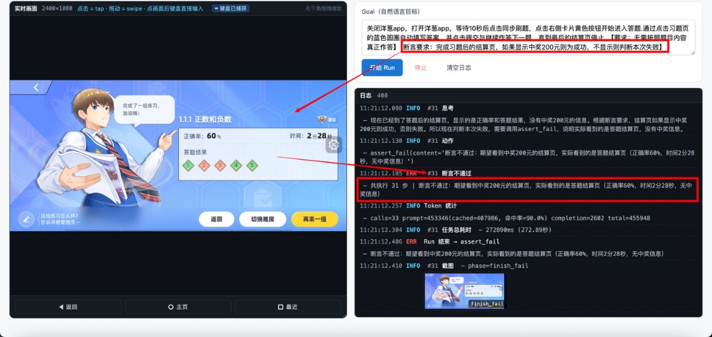

# ai-phone

**面向中小型公司的三端真机 AI 自动化中台** —— iOS / Android / HarmonyOS 同级原生支持，自然语言驱动的纯视觉决策，开箱即用的调度队列与多设备并发，执行器可插拔，一台 Mac 即可起完整链路。

> **产品形态**：ai-phone 不是一个执行器 SDK，而是把"投递批次 → 设备池调度 → 自然语言执行 → 终态广播 + HTML 报告 + 大盘统计"做成 QA 团队 / 业务回归大盘开箱即用的中台能力。**执行器是其中一个可替换组件**：默认内置自研的 VLM 纯视觉决策循环（带卡死检测 / 审判 / 断言等辅助系统），也可挂载第三方执行器作为额外引擎选项。

---


---

## 为什么选 ai-phone

| 能力维度 | ai-phone 提供的 |
|---|---|
| **三端真机原生** | iOS（WDA / mjpeg passthrough）/ Android（adb + scrcpy）/ HarmonyOS（hdc + hypium）三端等价。鸿蒙作为一等公民与 iOS / Android 同等支持，在开源生态里少见 |
| **调度队列 + 多设备并发** | `POST /api/submissions` 投递批次 → 实时按 `device_alias_pool` 分发到设备池 → Submission / Item TTL 兜底超时 → Kafka / Webhook 双通道终态广播 → HTML 报告自动落盘。设备占用锁 + readiness gate 防止派单到僵尸设备 |
| **自然语言驱动** | `runContent: "打开设置并进入关于本机"` 直接喂给 VLM，不写 selector / xpath / 步骤脚本 |
| **纯视觉决策** | 每步只看截图，不依赖 DOM / 控件树 / 无障碍服务，跨 App 跨平台不挑食 |
| **辅助系统护城河** | 卡死检测（本地 pHash 算法层、不烧 token）+ 异常介入审判（独立轻量模型，反复同坐标 / 同屏 / 震荡滑动自动召唤）+ 双图断言系统（before / after + 全步骤上下文对照终局裁决）+ 通道判定（结构化 / 自由对话自动分流）—— "VLM 是否真生效"不再是黑盒 |
| **三家协议自由组合** | 主 VLM 走 Doubao / Claude / GPT 三选一，辅助系统也可异家组合（如"主 Claude + 辅 Doubao 省成本"），全部走 env 切换、零代码改动 |
| **执行器可插拔** | 默认内置自研 VLM 决策循环；前端"引擎"下拉框允许挂载第三方执行器作为额外选项，调度 / 报告 / 设备池 / 终态广播仍然走中台统一链路 |
| **快速部署** | 一台 Mac + Postgres + 一根数据线即可起完整链路；K8s / Nginx 部署模板见 `deploy/`（M4 补） |

**典型用户**：

- 中小型公司 QA 团队 —— 真机上做 AI 化的兼容性 / 回归 / 冒烟测试
- 业务回归大盘想从"脚本维护"切到"自然语言投递"
- 海外团队需要切 Claude / GPT 跑英文 App（改两个 env 即用）

---

## 看一眼实际样子

**调度队列** —— 三端独立 FIFO + 正在执行 + 最近批次状态，一栏拉通：


**辅助系统护城河** —— VLM 自认 `finished`，但断言系统对照"中奖 200 元"业务条件复核失败 → 拦下落 `assert_failed`，避免误判成功（这是 ai-phone 与 Midscene 等 Plan-Loop 框架的根本差异：**AI 决策不再是黑盒**）：



更多场景（设备工作台、HTML 报告、运维大盘、AI 分析）见 [使用功能介绍](./使用功能介绍.md)。

---

## 30 秒上手

```bash
git clone https://github.com/dongxinsuperman/ai-phone.git
cd ai-phone/backend
cp .env.example .env  # 至少填 AI_PHONE_DB_URL + AI_PHONE_VLM_API_KEY
python3.11 -m venv .venv && source .venv/bin/activate && pip install -e .

# 终端 A：起 Server
uvicorn ai_phone.server.app:app --host 0.0.0.0 --port 8000 --reload

# 终端 B：起 Agent（接真机）
python -m ai_phone agent

# 终端 C：起前端
cd ../web && npm install && npm run dev
```

打开 <http://127.0.0.1:5180> → 选设备 → 进工作台 → 输入自然语言 goal → 看 VLM 跑。

> 详细前置 / 数据库 / 调试参数请看 [本地开发指南](./docs/getting-started.md)。
> iOS / HarmonyOS 接入需要额外配置，见 [iOS 接入](./docs/ios-setup.md) 与 [HarmonyOS 接入](./docs/harmony-setup.md)。

---

## 投递一条 case（最小示范）

```bash
curl -X POST http://localhost:8000/api/submissions \
  -H 'Content-Type: application/json' \
  -d '[{"caseId":"demo_001","platform":"android","runContent":"打开设置并进入关于本机"}]'
```

完整字段、错误码、Kafka / Webhook 回调格式见 [对外调用清单](./对外调用清单.md)。

---

## 当前状态

| 模块 | 状态 |
|---|---|
| 三端真机 driver + 镜像（iOS / Android / HarmonyOS） | ✅ 完整 |
| 调度队列 + 设备池（Submission / Item TTL / 别名 / 锁 / readiness gate） | ✅ 完整 |
| 终态广播（Kafka / Webhook / stdout 三选一） | ✅ 完整 |
| 自包含 HTML 报告 + 运维大盘 | ✅ 完整 |
| VLM 决策循环 + 辅助系统（卡死 / 审判 / 断言 / 通道判定） | ✅ 完整 |
| 多协议适配（Doubao / Claude / GPT 自由组合） | ✅ 完整 |
| 执行器可插拔（内置 VLM + Midscene 桥接） | ✅ 完整 |
| 历史回放页 / Case 加载对话框 | API 就位，前端待补 |
| 日志服务系统（统一收集 / 检索） | 待办 |
| K8s / Nginx 部署模板 | 待 M4 |

---

## 文档导航

| 文档 | 受众 | 内容 |
|---|---|---|
| [使用功能介绍](./使用功能介绍.md) | 调用方 / 业务同学 | 产品手册：7 大核心功能、调度模型、终态枚举、稳定性工程 |
| [对外调用清单](./对外调用清单.md) | 调用方 / CI 集成 | API 契约（v1.5 冻结）：投递 / 查询 / 取消 / Kafka / Webhook 完整字段 |
| [架构设计](./架构设计.md) | 二次开发者 | 架构方案：Server / Agent 角色、消息协议、数据库 schema、镜像链路 |
| [本地开发指南](./docs/getting-started.md) | 本地开发者 | 起后端 / 起 agent / 起前端、env 配置详解、FAQ |
| [iOS 接入指南](./docs/ios-setup.md) | iOS 接入者 | WDA / pmd3 / Xcode 自动续签 / tunneld 完整流程 |
| [HarmonyOS 接入指南](./docs/harmony-setup.md) | 鸿蒙接入者 | hdc / hmdriver2 / hypium 镜像后端切换 |
| [辅助系统核心逻辑及效果](./ai-phone的辅助系统核心逻辑及效果.md) | 算法调优者 | 通道判定 / 审判 / 断言 / 卡死检测 / 链式动作的效果与调参 |
| [Midscene 执行器接入方案](./Midscene执行器接入方案.md) | 执行器扩展者 | 第三方执行器挂载方案 |

---

## 工程组成

- `backend/`：Python 3.11（`pyproject.toml` 锁 `>=3.11,<3.13`），同一个包按启动参数切换 Server / Agent 角色
- `web/`：Vue 3 + Vite 前端（**纯 JavaScript，无 TypeScript**）
- `midscene-bridge/`：第三方执行器桥接子工程（独立 Node 工程，按需启用）
- `deploy/`：k8s / Nginx 部署模板（M4 阶段补）

---

## 致谢

三端能力栈站在巨人的肩膀上：

- [scrcpy](https://github.com/Genymobile/scrcpy)（Android 镜像）
- [WebDriverAgent](https://github.com/appium/WebDriverAgent)（iOS 控制）
- [pymobiledevice3](https://github.com/doronz88/pymobiledevice3)（iOS DVT 截图）
- [hmdriver2](https://github.com/codematrixer/hmdriver2)（HarmonyOS 控制）
- [adbutils](https://github.com/openatx/adbutils)（Android 控制）
