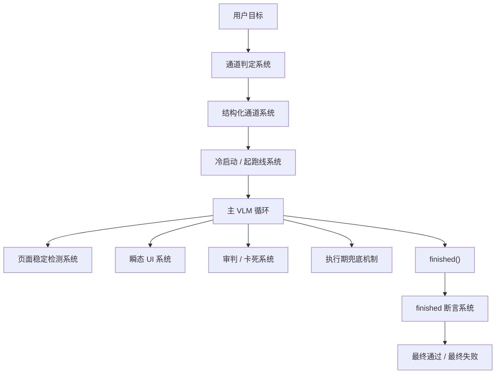

# ai-phone 的辅助系统核心逻辑及效果

## 1. 背景

`ai-phone` 的主执行链路看起来像是一个典型的 VLM Agent：

- 看当前截图
- 理解用户目标
- 输出下一步动作
- 执行动作
- 再看下一张图

但真正在工程上把这件事跑稳，仅靠一条“看图 -> 推理 -> 动作”的纯模型主循环是不够的。

原因很直接：

- 用户输入有强约束 case，也有自由描述
- App 页面有动态内容、过场动画、瞬态控件、弹窗、交互题
- 模型会误判当前页面，也会在局部路径上自洽甚至死循环
- “执行完成”和“结果成立”不是一回事

所以 `ai-phone` 的设计并不是把所有问题都交给主 VLM，而是逐步长出了一套“**VLM 主循环 + 多个辅助系统共同协作**”的混合执行架构。

这套辅助系统的目标不是替代 VLM，而是把 VLM 从“单点大脑”变成“高层决策器”，再用工程系统去补它最容易失稳的部分。

---

## 2. 总览

从“系统视角”去总结，`ai-phone` 的辅助系统更适合概括为 7 个主系统：

1. 冷启动 / 起跑线系统
2. 通道判定系统
3. 结构化通道系统
4. 审判 / 卡死系统
5. 页面稳定检测系统
6. 瞬态 UI 系统
7. finished 断言系统

另外还有一组执行期兜底机制，作为这些系统的公共支撑：

- 等待时长裁剪
- 链式动作限制
- 未知动作保护
- 会话分段
- 包名匹配与系统动作兜底

可以先用一张总图来理解它们之间的关系：

一句话概括：

- `通道判定` 决定这次任务属于哪一类
- `结构化通道` 决定强约束 case 的执行口径
- `冷启动 / 起跑线` 尽量把执行拉回可控起点
- `页面稳定 / 瞬态 UI / 审判` 负责过程稳定性
- `finished 断言` 负责终局真实性

---

## 3. 为什么一定要有辅助系统

### 3.1 纯 VLM 主循环的天然问题

如果没有这些辅助系统，主 VLM 往往会出现下面几类典型问题：

- 把自由描述当成强 case，或者把强 case 当成随便点点就行
- 在页面切换、动画未结束时过早识别当前画面
- 在视频工具栏、Toast、自动隐藏菜单这类瞬态场景中“看到了，但来不及点”
- 多次点击同一区域、重复看同一屏、连续滑动无效，仍然继续自我说服
- 任务想结束时，用一段听起来很合理的文字把错误结果包装成成功

### 3.2 工程上的核心思想

`ai-phone` 的思路不是“找一个更强的模型把所有问题吃掉”，而是：

- 把“目标理解”交给 VLM
- 把“过程约束”交给规则和轻量审判
- 把“瞬态时序问题”交给专门检测与接管逻辑
- 把“结果是否成立”交给独立断言系统

这是一种很典型的 Agent 工程化思路：

> 不把系统稳定性寄托在一次模型输出上，而是通过多层护栏，把错误尽量提前暴露、局部修正、终局拦截。

---

## 4. 冷启动 / 起跑线系统

### 4.1 作用

冷启动 / 起跑线系统的职责，是在真正进入主流程前，自动处理那些“用户已经明确写在前置条件里，而且适合系统直接做”的固定动作。

当前典型场景包括：

- 关闭 App
- 打开 App
- 进入一个可预期的起始状态

### 4.2 为什么需要它

如果把这些动作也交给主 VLM：

- 每次都要先识别一遍页面
- 还要推理“现在是不是该杀进程”
- 非常浪费 token，也容易把简单动作做得不稳定

这个系统的价值在于：

- 把重复、机械、明确的动作前置成系统行为
- 让主 VLM 尽量从“业务起点”而不是“脏运行状态”开始思考

### 4.3 当前实现方式

在当前代码里，相关逻辑主要体现在：

- `vlm_loop.py` 中的 `_detect_app_lifecycle_prelude()`
- `vlm_loop.py` 中的 `_run_app_lifecycle_prelude()`

它会从目标文本中识别诸如：

- `关闭 App`
- `重新打开 App`
- `杀进程`

这样的强前置语义，然后优先用系统动作执行，而不是先丢给主 VLM。

### 4.4 实际效果

它的效果不是“更聪明”，而是“更省、更稳、更统一”：

- 减少无意义的首轮 VLM 调用
- 避免主循环一上来就陷入脏状态判断
- 让长 case 的执行起点更加一致

---

## 5. 通道判定系统

### 5.1 作用

通道判定系统的职责，是先判断当前输入应该走：

- `结构化通道`
- 还是 `自由对话通道`

这一步非常关键，因为两类输入的执行哲学完全不同。

### 5.2 两种通道的差异

#### 自由对话通道

更像短指令或随手操作，例如：

- 点击某个按钮
- 切到某个 tab
- 进入某个页面

这类任务约束弱、上下文短，重点是快速完成目标。

#### 结构化通道

更像测试 case 或严格执行任务，通常包含：

- 测试标题
- 前置条件
- 操作步骤
- 预期结果
- 兜底分支

这类任务不是“做个大概”，而是要严格按语义执行并最终验收。

### 5.3 当前实现方式

通道判定系统不是只靠模型一句话判断，而是采用了“两级分类”：

#### 第一级：本地启发式

通过 `_compute_structured_signal()` 先扫描输入的结构化特征，例如：

- 是否包含四级标签
- 文本长度
- 引号、数字约束、逻辑词、顺序词、动词密度

#### 第二级：审判模型兜底

如果本地评分落在中间档，就会借助一次轻量 supervisor 判断，这次输入究竟更像：

- 结构化 case
- 还是自由描述

### 5.4 实际效果

这个系统的价值，不在于“分类本身”，而在于：

- 让后面的 prompt 强度与任务类型匹配
- 让结构化 case 自动打开更严的执行与审判护栏
- 让简单任务不要背上重型 case 的执行负担

一句话总结：

> 通道判定系统解决的是“同一个 Agent，如何同时服务短操作和强约束 case”的问题。

---

## 6. 结构化通道系统

### 6.1 作用

如果说通道判定系统解决的是“这次输入像不像强 case”，那么结构化通道系统解决的是：

> 一旦确认这是结构化 case，后续执行应该遵守什么额外规则。

它不是分类器，而是一套执行口径。

### 6.2 它和通道判定的区别

- `通道判定系统`：决定走哪条路
- `结构化通道系统`：决定走上这条路以后，执行规则要不要更严

也就是说，通道判定是入口层，结构化通道是约束层。

### 6.3 当前约束重点

当前结构化通道主要加强了几类规则：

- 按节顺序理解输入中的前置条件、操作步骤、预期结果、兜底
- 第一次异常禁止直接 `assert_fail`
- 优先遵守目标中的兜底分支，而不是自由发挥
- 在结束时走更严格的结果断言口径

### 6.4 为什么它值得单独算一个系统

因为很多复杂 case 的稳定性，并不是输在“分类错了”，而是输在：

- 虽然知道这是 case
- 但没有真的按 case 的方式去执行

结构化通道系统本质上是在告诉主 VLM：

- 这不是一次普通对话
- 这是一条带强约束和终局验收的执行任务

### 6.5 实际效果

它最直接的效果是：

- 降低自由发挥
- 提高对兜底分支和预期结果的重视程度
- 让同一条复杂 case 的执行轨迹更接近“测试执行”而不是“普通操作”

---

## 7. 审判 / 卡死系统

### 6.1 作用

审判系统的核心职责，是在主 VLM 的执行过程中，持续监督：

- 有没有偏航
- 有没有死循环
- 有没有陷入无效重复操作

这套系统不是在结果阶段发力，而是在**过程阶段**及时拦截。

### 6.2 它在看什么

当前实现里，审判 / 卡死系统重点盯下面几类风险：

- 同坐标桶连续点击
- 同屏复访问
- 连续无效滑动
- 滚动方向震荡
- 周期性长时间未推进

也就是说，它关心的不是“模型说得对不对”，而是：

> 这个执行轨迹看起来是不是已经不像在正常推进任务了。

### 6.3 两层结构

#### 本地探测层

先由本地规则快速发现疑似问题：

- 连续 3 次向上滑
- 相同屏幕被访问 3 次
- 同一位置点击 3 次

这一层的优点是：

- 快
- 不耗模型
- 能尽早发出信号

#### 审判裁决层

命中阈值后，再交给轻量 supervisor 判断：

- 这次应该 `ALLOW`
- 还是应该 `KILL`

当前结构化通道下，还设置了 `ALLOW` 上限，防止“永远再放一次”。

### 6.4 为什么它很重要

如果没有这套系统，主 VLM 在复杂场景中最容易出现两类幻觉：

- 我好像还在推进，其实已经卡死
- 我再等等 / 再点一下 / 再滑一下，也许就好了

审判系统的价值，就是把“模型的主观信心”拉回“执行轨迹的客观证据”。

### 6.5 实际效果

这套系统最明显的效果是：

- 减少无意义 token 消耗
- 避免长时间挂在错误路径上
- 让错误尽早暴露，而不是拖到最终 finished 再失败

它不是让系统更会做事，而是让系统**更早停止做错事**。

---

## 8. 页面稳定检测系统

### 7.1 作用

页面稳定检测系统的职责，是在很多动作之后，不立刻把“过渡中的画面”送给主 VLM，而是先等页面进入一个足够可识别的稳定状态。

### 7.2 当前实现方式

当前采用的是基于 `pHash` 的轻量等待器：

- 总超时 5 秒
- 轮询 0.4 秒
- 差异率阈值 0.04

这套参数不是追求“绝对静止”，而是追求：

- 既不要太早读错
- 也不要等到所有反馈都消失

### 7.3 为什么这里很关键

如果稳定检测过严：

- 会把视频进度条、Toast、工具栏这类短暂反馈等没了
- VLM 拿到的反而是“错过关键信号”的图

如果稳定检测过松：

- VLM 会看到动画中间态
- 更容易误判当前页面

所以它本质上在平衡两个目标：

- 页面要足够稳定可识别
- 但反馈不能等到完全消失

### 7.4 它和瞬态 UI 的关系

页面稳定检测系统是通用底座；
瞬态 UI 系统则是在此基础上，专门处理“等正常稳定会错过”的特殊场景。

可以理解为：

- 稳定检测是默认路径
- 瞬态 UI 是特殊接管路径

---

## 9. 瞬态 UI 系统

### 8.1 作用

瞬态 UI 系统专门解决这类问题：

- 视频工具栏
- Toast
- 自动隐藏菜单
- 半透明浮层

这些控件有一个共同特点：

- 点击后会出现
- 但只活 2-3 秒
- VLM 正常“截图 -> 推理 -> 执行”往返往往已经来不及

### 8.2 这个系统分成三层

从总结口径看，它可以算一个系统；从内部结构看，它包含三层：

1. run 级门控
2. step 级瞬态检测
3. 接管链执行

### 8.3 run 级门控：什么时候打开瞬态能力

不是所有任务都值得为瞬态 UI 付出检测成本。

所以当前实现里，系统会先做一次 run 级判断：

- 看 env 总开关是否允许
- 再看目标文本是否命中白名单关键词

例如：

- 视频
- 播放
- 进度条
- 工具栏
- 返回箭头

命中后，本次 run 才会 armed，允许后续 click 进入瞬态检测逻辑。

### 8.4 step 级检测：三段式识别

真正的瞬态识别不是只看前后帧，而是三段式判断：

1. 点击前
2. 点击后短暂出现时
3. 一段时间后自动隐藏时

系统会计算：

- 出现率
- 消失率
- 峰值比

并在横屏场景对顶部 / 底部 ROI 做重点判断，因为很多工具栏只出现在屏幕上下边缘。

### 8.5 接管链：重唤起 + 立即命中

一旦检测命中，系统会缓存“工具栏完整可见”的那一帧给下一步 VLM 看。

下一步执行时，不是直接点模型给的坐标，而是自动串成一条接管链：

1. 先重放触发工具栏的 click
2. 等约 500ms
3. 再立刻点击 VLM 给出的目标坐标

这一步极其关键，因为它把：

- “工具栏可见时模型看到了什么”
- 和“真正执行时工具栏还在不在”

这两个时间差问题尽量抹平了。

### 8.6 它解决了什么

瞬态 UI 系统最典型的价值，不是“提高一点识别率”，而是让系统第一次有机会做成这类原本几乎注定失败的操作：

- 唤起视频工具栏后点返回箭头
- 唤起工具栏后点倍速
- 抓住短寿命菜单里的入口

### 8.7 它的边界

这个系统也有天然边界：

- 视频本身一直在动，整屏 pHash 容易被背景噪声稀释
- 工具栏往往只占局部区域
- 适合“点按钮”，不如“拖进度条”稳定

所以它本质上是：

> 把原本完全来不及的瞬态交互，尽量拉到“有机会成功”的状态。

而不是保证所有视频场景都一定稳。

---

## 10. finished 断言系统

### 9.1 作用

finished 断言系统解决的是另一个完全不同的问题：

> 主 VLM 说“任务完成了”，系统能不能直接信？

答案是：不能。

因为主 VLM 很可能会在以下场景中自我说服：

- 证据不充分，但语言很自信
- 页面看起来差不多，就当满足了
- 过程做得像成功，但最终结果并没真正落到位

所以 `finished()` 不能直接采纳，而要有一个独立的终局验收器。

### 9.2 当前实现思路

当前 finished 断言系统的职责是：

- 主 VLM 申请 finished
- 系统暂停直接成功返回
- 发送一次独立结果复核
- 根据 PASS / FAIL 决定：
  - 采纳 finished
  - 还是改写成失败

### 9.3 两套口径

当前实现里，finished 断言并不是一刀切，而是与通道类型对应：

#### 结构化 case

唯一验收标准是输入里的 `预期结果`。

要求是：

- 只围绕预期结果逐条做验收
- 严格，但不是逐字匹配
- 允许同义表达、界面别名、常见产品话术变体
- 语义等价可以通过
- 证据不足不能通过
- 不去验前置条件，不去验历史顺序，不去验过程

#### 自由对话

更偏向：

- 最后一个动作结果是否与最终截图一致

这类任务通常不需要像测试 case 一样逐条对照预期结果。

### 9.4 为什么它很重要

断言系统真正改变的是系统闭环：

- 没有断言系统：主 VLM 说 finished 就 finished
- 有断言系统：主 VLM 只能“申请 finished”，最终是否采纳由独立验收器决定

这会把系统从：

- “模型自述完成”

拉到：

- “系统独立验收通过后才算完成”

### 9.5 它的价值

这套系统最核心的价值不是“更严格”，而是：

- 把过程和结果拆开
- 把执行和验收拆开
- 让系统最终成功的标准，不再只是模型自信地讲了一段话

---

## 11. 其它重要兜底机制

除了上面 5 个主辅助系统，当前实现里还有几组很关键的执行期护栏。

### 10.1 wait 时长上限

模型可以要求等待较长时间，但系统仍会做硬上限控制。

当前上限：

- `MAX_WAIT_SECONDS = 1800`

也就是最多 30 分钟。

这样做的目的，是允许长视频场景，同时避免异常 case 无限等待。

### 10.2 链式动作限制

系统允许在单轮输出里串联少量动作，但不是无限开放。

当前：

- `CHAIN_MAX_ACTIONS = 2`

作用是：

- 让高确定性连续点击更快
- 同时避免主 VLM 一次输出过长动作链，脱离可观测反馈

### 10.3 未知动作保护

主 VLM 不是想输出什么就能执行什么。

动作类型必须落在系统允许集合里，否则会被拒绝并返回提示。

### 10.4 会话分段

长 case 跑到一定程度后，prompt 可能越来越重。

系统会在合适时机做分段重置，避免：

- 历史上下文无限膨胀
- 响应变慢
- 模型被过长历史拖住

---

## 12. 这些系统组合起来，实际带来了什么效果

如果只看单个模块，它们各自像是在补一个小洞。

但真正的价值在于：这些洞补在一起后，系统的执行形态发生了变化。

### 11.1 从“单模型决策”变成“分层协作”

现在系统不再是：

- 截图 -> 模型 -> 动作

而是：

- 输入先分类
- 起跑线先归位
- 页面先稳定
- 瞬态场景走专门接管
- 中途持续被审判监督
- 结束前还要过独立断言

### 11.2 从“尽量做对”变成“尽量少做错”

很多辅助系统的价值不是让成功率直接拉满，而是：

- 及时识别风险
- 在错误路径上尽早止损
- 防止系统用一长串看似合理的过程把错误一路放大

### 11.3 从“模型能力驱动”变成“系统能力驱动”

随着这些辅助系统逐渐长出来，`ai-phone` 的稳定性越来越不只是模型强弱决定，而是：

- 模型负责高层语义判断
- 工程系统负责过程治理、时序兜底和结果验收

这其实是从“模型项目”走向“Agent 系统”的关键一步。

---

## 13. 方法论总结

如果要用一句话总结 `ai-phone` 这些辅助系统背后的设计思想，我会写成：

> 不把所有问题都交给主 VLM，而是把执行拆成“目标理解、过程治理、瞬态接管、终局验收”几层，让每一层只解决它最擅长的问题。

再展开一点，这套方法论有 4 个核心原则：

### 12.1 明确区分“过程问题”和“结果问题”

- 审判系统管过程
- 断言系统管结果

不要让一套系统同时负责所有问题。

### 12.2 用本地规则先挡掉低成本错误

像：

- 连续同屏
- 重复点击
- 连续无效滑动

这类问题没必要每次都丢给大模型。

### 12.3 把模型最不擅长的时序问题抽出来单独做

比如：

- 自动隐藏工具栏
- Toast
- 过场反馈

这些本质上不是“理解问题”，而是“时间窗问题”。

### 12.4 让 finished 变成“申请”，而不是“宣布”

只有这样，系统才真正拥有“最终结果的裁决权”。

---

## 14. 结语

`ai-phone` 的价值，不只是“让 VLM 会点手机”，而是逐渐把一个纯模型驱动的执行器，做成一个带有工程护栏、执行治理、结果验收能力的混合系统。

今天这些辅助系统还远远不是终点：

- 瞬态 UI 仍有视频噪声边界
- 结构化 case 的策略仍可继续细化
- 断言系统也还可以继续打磨业务语义稳定性

但它们已经证明了一件事：

> 在手机自动化这种高不确定、强时序、重反馈的场景里，真正让系统变稳的，不是单纯换一个更强的模型，而是围绕主循环长出一整套辅助系统。

这也是 `ai-phone` 从“能跑”走向“可控、可验、可展示”的关键路径。

---

## 15. 代码参考

本文主要基于以下实现位置梳理：

- 主循环与辅助系统主入口  
  [vlm_loop.py](/Users/dongxin/代码文件/sonic合集/ai-phone/backend/ai_phone/agent/runner/vlm_loop.py)

- 主 VLM Prompt  
  [prompt.py](/Users/dongxin/代码文件/sonic合集/ai-phone/backend/ai_phone/shared/prompt.py)

- 页面稳定检测  
  [stability.py](/Users/dongxin/代码文件/sonic合集/ai-phone/backend/ai_phone/agent/runner/stability.py)

- 瞬态 UI 检测与接管  
  [transient_ui.py](/Users/dongxin/代码文件/sonic合集/ai-phone/backend/ai_phone/agent/runner/transient_ui.py)

- 全局配置  
  [config.py](/Users/dongxin/代码文件/sonic合集/ai-phone/backend/ai_phone/config.py)
