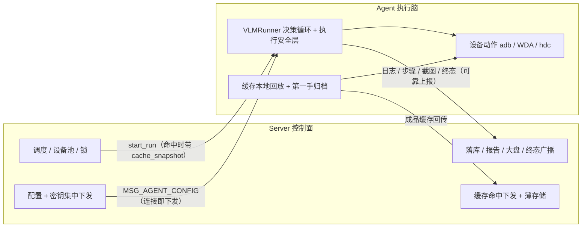

# 分布式 Agent 大脑架构说明

> 本文档适用于 `main` 分支（默认主线）。
>
> 核心目标：对调用方保持无感知。VLM 决策与执行安全层放在 **Agent 本地**，Server 退为**控制面**——集中下发配置 / 密钥、命中下发缓存 + 薄存储、调度、落库、报告、大盘、终态广播。

---

## 一、架构一句话

```text
Server / Web：管理设备、创建任务、集中下发配置/密钥、命中下发缓存、记录日志/报告/大盘
Agent：连接手机、本地跑 VLM 决策循环（含执行安全层）、本地回放/归档缓存、执行设备动作、回传结果
```

也就是：

```text
Agent 是大脑（执行脑在本地），Server 是控制面（集中管控 + 薄存储）
```

与 `next/server-brain`（Server 大脑）的根本区别只有一个：**VLM 决策执行脑放在哪**。本线放在 Agent 本地（就近决策、Agent 侧算力可用、模型密钥由 Server 下发但不常驻），server-brain 放在 Server 集中。两条线**数据库 schema 与产品能力兼容、二选一部署**。

---

## 二、与 Server 大脑的对比

| 维度 | `main`（分布式 Agent 大脑） | `next/server-brain`（Server 大脑） |
|---|---|---|
| VLM 决策执行脑 | Agent 本地 `VLMRunner` | Server 集中 |
| 执行安全层（页面稳定 / 卡死 / 审判 / 断言 / 路标 / 瞬态 gate） | Agent 本地 | Server |
| 模型密钥 | Server 集中下发，Agent 不常驻 | Server 集中持有 |
| 缓存 V1/V2/V3 | 命中 Server 下发 → Agent 本地回放 + 第一手归档回传 → Server 薄存储 | Server 集中回放 + 归档 |
| Server ↔ Agent 通道 | 配置 / 缓存下行 + 日志 / 步骤 / 终态 / 成品缓存上行（无 driver RPC） | driver RPC（命令 / 结果） |
| `execution_mode` | `agent_brain` | `server_brain` |

数据流：



---

## 三、关键机制（M1–M5）

### 3.1 执行脑下沉（M1）

`engine=vlm` 默认由 Agent 本地 `VLMRunner` 跑完整决策循环（截图 → VLM → 动作 → 执行安全层）。Server 不再有进程内 VLM 主循环，退为控制面。

### 3.2 配置集中分发（M2）

Agent 连接 Server（hello）后，Server 立即下发一次 `MSG_AGENT_CONFIG`；Agent `set_runtime_override` 覆盖全局 `get_settings()`，全进程读点一次性生效。配置三分区：

- **Agent 本机物理必需**（连接四元组 + iOS 本机签名 / 端口 / 路径）：不下发。
- **Server 基础设施 / 敏感**（`db_url` / kafka 密码 / 内部 token 等）：绝不下发。
- **执行配置**（含 Run 阈值、模型出口）：Server 统一下发控制。

配置变更走"改 Server 配置 + 重启 Server → Agent 自动重连重新拉"，不做运行时主动推送。

### 3.3 事件上报保真（M3）

执行脑下沉后，日志 / 步骤 / 截图 / 终态经 Agent 进程级可靠队列（`ReliableReporter`）严格保序、断线留存、重连补发地送达 Server；带 `event_id` 去重。Web 进度 / 报告与 Server 大脑时一致、无感。上报全程 fire-and-forget，不阻塞执行。

> web 回显优化：Server 收到日志 / 步骤后**先广播给浏览器**（实时回显），落库走后台保序队列；run 收尾前排空队列，保证一次性生成的 HTML 报告读到完整 `RunStep` / `RunLog`。

### 3.4 模型凭证集中（M5）

模型凭证随配置下发，Agent 本机不常驻 key（本机 `.env` key 仅作下发未达时的兜底）；凭证用完即用、不落盘、不进日志、脱敏。默认按"可信执行环境"对待。若合规要求 Agent 不得持有模型能力，请改用 `next/server-brain` 线。

### 3.5 缓存下沉（M4）

V1 / V2 / V3 三套缓存（交叉并存）：

- **命中**：Server dispatch 前查命中，随 `start_run` 下发 `cache_snapshot`。
- **回放**：Agent 预取证据图（V2 landmark 图 / 瞬态 gate 证据图）→ 本地回放（V1 像素稳定 / V2 phash 对齐 / V3 `plan_intent` 每步重定位）→ 最终断言 / 瞬态 gate → `run_done`。
- **归档**：首跑成功后，Agent 用执行第一手数据（结构化动作 / 原始时序 / 截图字节）整理成与 server-brain **同 schema** 的成品缓存，经可靠通道回传 Server。
- **Server 薄存储**：命中查询 + 接收成品 upsert + 失败删 + V3 标记可疑（suspect）。

---

## 四、对外 API（无感）

对外主入口与 server-brain 一致：`POST /api/submissions`（批次投递）。调用方不需要知道这次 Run 由 Agent 还是 Server 决策，执行架构是平台内部实现细节。完整字段见 [external-api（对外调用清单）](./external-api（对外调用清单）.md)。

确认这次 Run 走分布式 Agent 大脑：

```bash
curl http://<server-host>:8000/api/runs/<run_id>
```

关键字段：

```json
{ "engine": "vlm", "execution_mode": "agent_brain" }
```

---

## 五、部署者需要准备什么

1. **Server 端**：配置数据库、Agent token，并把**模型出口（VLM key / url / model）集中配在 Server**——它会随配置下发给 Agent。
2. **数据库**：在现有库上跑增量 SQL（`backend/migrations/distributed_agent_brain_v1.sql`、`distributed_agent_brain_v2.sql`），均为向前兼容的加法。
3. **Agent 端**：每台接手机的电脑启动 Agent、指向同一 Server；**Agent 本机不需要配模型 key**（由 Server 下发）。

Agent 机器仍需本机真机环境（adb / WDA / hdc / ffmpeg）——架构搬迁只是把 VLM 决策与密钥的归属变了，不消除真机系统依赖。

---

## 六、数据库策略（与 server-brain 同库兼容）

两条线的数据库 schema 向前兼容。从 `next/server-brain` 迁来：**备份后在同一套库上跑增量 SQL 即可升级到 `main`**，不需要新建库。

> 硬约束：**同一时间只让一个架构连同一套库跑**。别让 `main`（agent_brain）和 `next/server-brain` 两个服务同时写同一个库，否则会互相抢任务 / 覆盖设备池。

---

## 七、当前支持范围与限制

已完成（M0–M5，单 Pod，代码 + 真机验证）：

- 三端（iOS / Android / HarmonyOS）`engine=vlm` Run 走 Agent 本地决策。
- 配置 / 凭证集中下发；Agent 无本机 key 也能跑。
- 缓存 V1/V2/V3 命中下发 + Agent 本地回放 + 第一手归档回传 + Server 薄存储。
- 事件上报保真 + web 回显实时。

暂缓（M6，按需再做，不阻塞单 Pod 生产）：

- **Server 多 Pod 化**：当前 Hub / 锁 / 调度仍在单进程内存，部署请用单 Pod：

```bash
uvicorn ai_phone.server.app:app --host 0.0.0.0 --port 8000 --workers 1
```

  多 Pod（Redis + 共享 / 对象存储 + 分布式锁 / 调度 + lease 收口）是独立后续里程碑。

---

## 八、与 next/server-brain 的关系

- `main`（本线）：分布式 Agent 大脑，默认主线。
- `next/server-brain`：Server 大脑，并行架构线，长期保留（合规 / 强集中管控场景）。
- 两线同库兼容、二选一部署。
- **历史**：本线由老 `main`（Agent 大脑 v0.1.x 轻量版）演进而来，同属 Agent 脑血脉（执行脑一直在 Agent，新增 Server 集中配置 / 密钥 / 缓存薄管控）；v0.1.x 历史快照见 tag `archive/main-frozen-2026-05-30`。
- **未来**：计划用配置开关把"Agent 脑 / Server 脑"两种执行模式统一回单一 `main`，届时 `next/server-brain` 合回主线。

---

## 九、最小启动示例

Server 机器：

```bash
cd backend
source .venv/bin/activate
# 在现有库上跑增量（首次或升级时）
psql "$AI_PHONE_DB_URL" -f migrations/distributed_agent_brain_v1.sql
psql "$AI_PHONE_DB_URL" -f migrations/distributed_agent_brain_v2.sql
uvicorn ai_phone.server.app:app --host 0.0.0.0 --port 8000 --workers 1
```

Agent 机器（本机不需配模型 key，由 Server 下发）：

```bash
cd backend
source .venv/bin/activate
python -m ai_phone agent --server http://<server-host>:8000 --token <AI_PHONE_AGENT_TOKEN>
```

Web：

```bash
cd web
npm install
npm run dev
```

浏览器打开 <http://127.0.0.1:5180>，进设备工作台，选 `vlm`，输入目标并开始 Run；`curl /api/runs/<run_id>` 看到 `execution_mode=agent_brain` 即说明本架构链路生效。
