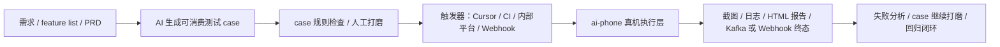

# 产品边界与出发点

很多人第一次看 ai-phone，会把它理解成一个“能用自然语言点手机的工具”。这个理解没有错，但只看到了一小层。

ai-phone 的出发点不是再做一个自动化执行器，也不是把 Appium、控件树或脚本框架换成 VLM。它更像 AI 测试方法论里的**真机执行层**：上游可以由 Cursor、CI、内部测试平台或 AI 助手生成可执行测试 case，下游由 ai-phone 把这些自然语言 case 排队、调度到真实设备上执行，并把截图、日志、报告和终态结果回传。

一句话说：

> ai-phone 不是测试平台本身，而是接在测试平台、CI、AI 编程工具之后的 AI 云真机执行中台。

## 为什么需要它

AI 时代的测试，不只是“让 AI 帮我写 case”。真正困难的是让 case 进入闭环：

如果只停在“AI 生成测试用例”，最后仍然要人复制、找设备、手动执行、截图对账，效率优势会被链路损耗吃掉。

ai-phone 补的是后半段：**AI 生成之后，能不能立刻在真机上跑起来，能不能稳定地产生可追溯结果，能不能被外部系统当成执行层集成。**

## 它负责什么

ai-phone 负责把最终可执行语义落到真实设备上：

- 接收外部平台、CI、自动化脚本或 AI 编程工具提交的批量 case。
- 根据平台和设备别名调度 Android / iOS / HarmonyOS 真机。
- 用 VLM 视觉决策循环执行自然语言 `runContent`。
- 在执行外层提供页面稳定、卡死检测、审判、断言、状态路标等安全层。
- 生成自包含 HTML 报告，记录步骤截图、日志、token 消耗和失败原因。
- 通过 Kafka / Webhook / API 查询等方式把终态结果回传给调用方。
- 提供 Web 运维面，用于看队列、看设备、调试真机、维护别名和查看报告。

## 它不负责什么

这些边界需要说清楚，否则很容易把 ai-phone 理解成一个更大的测试平台：

- 不做测试平台：不承担项目管理、模块树、用例库、成员权限、测试计划和业务编排。
- 不做 case 生成平台：case 可以由 Cursor、内部平台或 AI 助手生成，ai-phone 只接收最终可执行语义。
- 不自动补 case 前置依赖：账号、数据、入口路径、异常注入方式需要调用方写进 `runContent`。
- 不判断业务覆盖度：哪些场景该测、优先级如何、覆盖是否充分，是测试策略问题，不是执行层问题。
- 不做 Appium / W3C 兼容层，也不依赖 DOM、WebView inspector 或控件树。
- 不承诺任意自然语言都能稳定执行。稳定性取决于 case 是否足够可消费、设备状态是否可控、预期是否能被视觉判断。

## 和 AI 生成 case 的关系

ai-phone 不和“AI 生成测试用例”比较效率。它们不是一层能力。

- AI 生成 case：负责把需求、feature list、PRD 或人工意图转成测试输入。
- ai-phone：负责把这个输入放到真实设备上执行，并返回可追溯结果。

如果 case 写得更接近 [AI 可消费测试用例](./ai-consumable-test-cases（AI可消费测试用例指南）.md)，ai-phone 执行会更稳；如果只是人类 QA 提纲，执行器仍然可能因为账号、路径、断言、分支等信息缺失而跑不动。

完整 case 方法论可参考 [ai-executable-case-pattern](https://github.com/dongxinsuperman/ai-executable-case-pattern)，已有 case 扫描可参考 [ai-testcase-lint](https://github.com/dongxinsuperman/ai-testcase-lint)。

## 和 CI 的关系

持续集成不是 ai-phone 的竞争对象，而是它最适合接入的位置。

典型链路是：

1. Cursor / CI / 内部平台触发测试。
2. 上游生成或选择一批 `runContent`。
3. 调用 `POST /api/submissions` 投递给 ai-phone。
4. ai-phone 在真机池中执行。
5. 外部系统通过 Kafka / Webhook / API / HTML 报告拿结果。

所以 ai-phone 的核心价值不是“自然语言点一下手机”的演示，而是让 AI 生成或维护的 case 能进入真实设备执行闭环。
