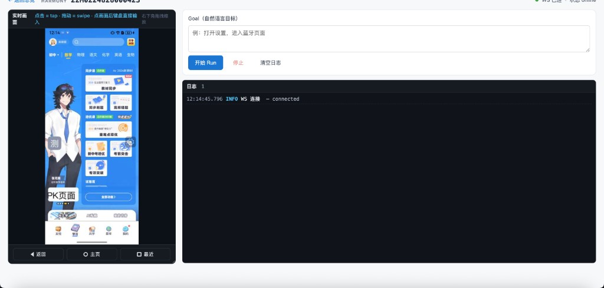
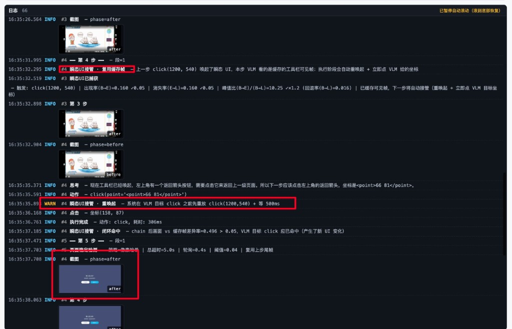
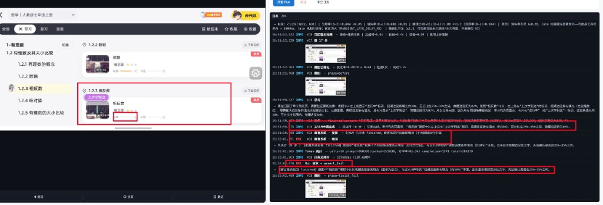
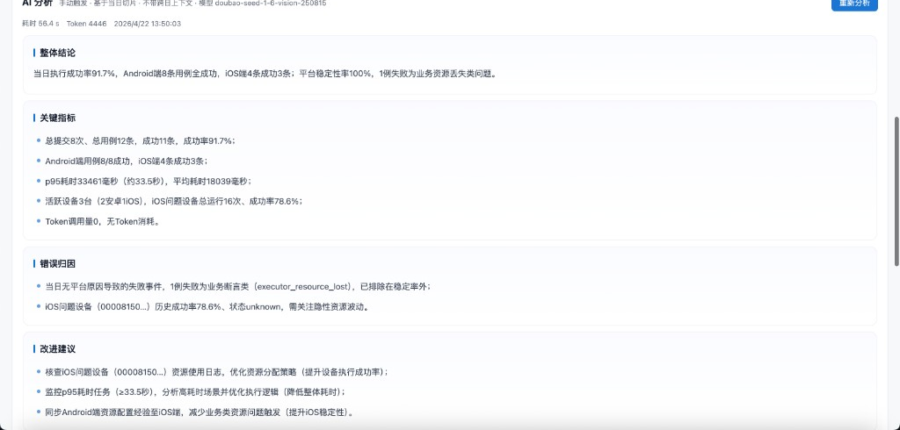

# ai-phone · AI 云真机执行器

**定位**：面向内部测试平台与 CI 的真机执行层。批量接收自然语言 case，驱动 iOS / Android / HarmonyOS 真机并发执行，通过 Kafka 异步广播终态结果并生成自包含 HTML 报告。

**核心理念**：对外契约只认 `submissionId + caseId + platform` 三元组，内部工程自洽；业务测试同学只需浏览器，零安装、零配置。

---


---

## 能力矩阵

| 能力 | 说明 |
|---|---|
| 三端同构 | iOS / Android / HarmonyOS 三端真机对上层完全透明，切平台仅需替换 `platform` 字段 |
| 纯视觉 VLM 驱动 | 不依赖控件树、XPath 或选择器；基于截图的视觉决策循环，三端共用同一套 prompt 与动作协议 |
| 自然语言 case | `runContent` 直接描述测试意图，无需脚本化 |
| 批量并发执行 | 单次 submission 支持数十条 case，按平台 / 设备自动并发调度 |
| 设备池即插即用 | USB 接入自动入池、拔出自动离线；无配置修改、无进程重启 |
| 设备别名绑定 | 调用方可用业务化别名（如 "华为折叠-回归-01"）指定设备，外部只感知别名 |
| 自包含 HTML 报告 | 单 case 与批次汇总两层；零外部依赖，带执行轨迹、截图、token 用量、设备标识 |
| 实时画面直推 | iOS MJPEG / Android H.264 over MSE / HarmonyOS hypium MJPEG，端到端 < 100ms |
| 运维大盘 | 吞吐、耗时分布、token 消耗、平台维度聚合一页呈现 |

---

## 产品边界

<!-- 截图占位：定位关系图（外部测试平台 → ai-phone → 真机集群三层关系，全宽）—— 后续补 -->

- **是**：外部测试平台 / CI / 自动化脚本背后的真机执行器
- **不是**：测试平台本身。不承载项目管理、模块树、用例管理、权限、成员体系与业务编排，这些由调用方平台负责
- **职责**：将调用方提交的自然语言 case 稳定、高并发地执行在真机上，并异步回传终态

---

## 核心功能

### 一、自然语言 case 执行

调用方无需编写脚本，`runContent` 直接声明测试意图。典型场景：

```
登录回归用例：
在登录页输入账号 qa_test_001，密码 Qa@123456，点击登录按钮，
等待跳转至首页后，校验顶部存在"欢迎"文案。
```

```
订单创建冒烟用例：
进入商品列表页，选择任意一个在售商品进入详情，点击加入购物车，
进入购物车，点击结算并提交订单，校验订单提交成功提示出现。
```

```
多端一致性用例：
打开 App 首页，进入"设置-关于"，校验版本号字段非空，
返回首页，进入"我的"，校验用户昵称字段非空。
```

Agent 侧 VLM runner 的执行循环：截图 → 模型决策 → 解析动作 → 驱动真机 → 校验稳定 → 下一步。三端共用同一份 prompt 与动作协议（`click` / `long_press` / `drag` / `type` / `scroll` / `wait` / `finish` / `fail`），断言失败与执行异常分离记录。

<!-- 截图占位：VLM 决策循环示意（截图 → AI 思考 → 真机动作 → 下一帧四宫格，16:9 可做 GIF）—— 后续补 -->

### 二、三端同构真机驱动

| 平台 | UI 驱动 | 画面链路 | 中文输入 |
|---|---|---|---|
| iOS | pymobiledevice3 + WDA（`xcodebuild test` 自动拉起并续签证书） | WDA mjpeg server 原样透传至前端 ``，旋转自适应 | WDA `type` 原生支持 |
| Android | adbutils + vendored scrcpy 2.4 | scrcpy H.264 → ffmpeg fmp4 → WS 推送，前端 Media Source Extensions | 自动 push + activate ADBKeyBoard，执行后切回原 IME |
| HarmonyOS | hdc + hmdriver2 + hypium Captures | hypium 协议独立 socket MJPEG 推流，约 30 fps | hmdriver2 `input_text` 原生 Unicode |

调用方接口不区分平台，切换 `platform` 字段即可。



### 三、批量提交与设备别名

调用方接入面，覆盖请求入口、预调度、契约一致性。

#### 3.1 提交入口

- `POST /api/submissions` 同步返回准入结果：`accepted + submissionId + rejectReason?`
- 整批 **all-or-nothing**，任一 item 不过即整批拒绝且不写库，调用方收到的状态明确无歧义
- 准入硬边界四项：

| 校验 | 失败拒因 |
|---|---|
| `platforms` 元素 ∈ `{android, ios, harmony}` 白名单 | `invalid_platform` |
| 任一 `platforms` 元素当前至少存在一台 `online` 设备（不要求 ready） | `no_device_on_platform` |
| 若 `deviceAliasPools` 非空，池里**每个**别名都必须在 `device_aliases` 表命中 | `unknown_device_alias` |
| `caseId` / `runContent` / `platforms` 非空 | `missing_field` |

准入通过即持久化：写入一条 `Submission`（`state=accepted` / `expire_at = now + 3h`）与 N 条 `SubmissionItem`（`state=queued`），随后唤醒调度循环。

#### 3.2 设备别名与预调度

- 每台真机可绑定业务化别名，如 "iOS-回归-01" / "华为折叠-01"
- `GET /api/devices/available` 返回 `serial + alias + platform`，调用方可在提交前完成端 / 设备级编排
- 别名命中规则两级严格：

| 场景 | 行为 |
|---|---|
| `deviceAliasPools[p]` 缺省 / `null` / `[]` | 该端全平台调度，池中择一执行 |
| `deviceAliasPools[p] = ["A1"]`（锁单台） | 严格指名 A1，A1 离线 / 未就绪 / 被占用时保持排队、不降级 |
| `deviceAliasPools[p] = ["A1","B1",...]`（子集池，v1.7） | 在池中**动态消费**：哪台先 ready 就被哪台拿走，自然形成"快机多跑、慢机少跑、坏机不跑" |
| 池里别名 · 准入阶段未命中 | **整批同步拒绝**（`unknown_device_alias`），不入队 |
| 池里别名 · 在运维侧被中途删除 | item 保持排队直到 submission 3h 超时，终结为 `submission_timeout`，消费方明确收到 |

锁单台是契约级承诺：池只填了一台时，执行与报告就落在那一台，不会被悄悄换人。
子集池是 v1.7 新增能力——多业务方"资产私有 + 平台共有"场景下，业务方把自己团队
的多台 alias 一起填进 pool，平台只在这几台之间动态分配，不会跑到别的团队设备上。

#### 3.3 一致性呈现

HTML 报告、前端列表、WS 事件、Kafka 终态消息均以 **"别名 + 设备标识"** 组合呈现，兼顾唯一性与人类可读性。


### 四、并发调度与排队

调度层是执行器走向成熟运维的关键能力。本节从队列模型一路铺到终态收口。

#### 4.1 调度模型

- **平台分池 FIFO**：`android` / `ios` / `harmony` 三池独立，跨平台天然并行；同平台按 `enqueued_at` 严格 FIFO
- **事件驱动主循环**：`_drain_loop` 由事件 `kick` 唤醒，2s 一次兜底 tick；触发 kick 的事件包含新 submission 入队、run 终态回流、设备 readiness 变化、设备锁释放
- **真相以数据库为准**：内存队列仅为本轮待派发副本，Server 重启时 `_reload_queues_from_db()` 按 `state=queued + enqueued_at ASC` 重建，队头次序不丢
- **每轮派发公平性**：对每个平台从队头尝试派发，派得出就消耗并往前推进，派不出（无 ready 设备 / 全被锁）立即让位下一平台，不自旋、不饿死

#### 4.2 设备匹配规则

派发单条 item 时，候选设备须同时满足四项：

1. `platform` 一致
2. `status = online`
3. `readiness.ready = True`（由 Agent 侧探针上报；readiness 未上报的设备视作"不确定"，不挑它，等下一轮）
4. 当前未被设备锁占用

上述任一不满足，item 原位保持 `queued`，等下一次事件驱动或兜底 tick。

#### 4.3 设备锁（auto / manual 双类型）

- `auto`：调度器派发时自动申请，TTL = item 超时（1h）+ 60s 余量，自动释放
- `manual`：前端运维同学独占调试时申请，带心跳续命，心跳断开即释放
- 两类锁互斥不互抢：业务同学在前端调试的设备不会被自动化队列抢走，自动化跑着的设备也不会被误操作打断
- 锁的身份 `holder = sched-{itemId}` 带 `meta = {submission_id, item_id, case_id}`，前端和审计可反查

#### 4.4 超时守护

守护循环每 30s 扫一次：

| 级别 | 上限 | 触发动作 |
|---|---|---|
| Submission | 3h（`expire_at`） | 仍 `queued` 的 item 全部落成 `failed + submission_timeout`，发单 item 终态事件 + 汇总事件（`reportUrl=null`）；已 running 的交给 item 超时继续处理 |
| Item running | 1h | 向对应 agent 发 `MSG_STOP_RUN`，预写 `status_reason=run_timeout`；终态由 `on_run_done` 回流落位 |

超时也是 Kafka 消费方能明确对账的终态，**永远不会有 item 无限悬挂无广播**。

#### 4.5 终态枚举（11 项 statusReason）

面向消费方对账的固化枚举，从不再扩。执行侧任何异常都会被归类到这 11 项之一：

| 枚举 | 语义 |
|---|---|
| `completed` | VLM `finish` 动作落位，正常完成 |
| `assert_failed` | VLM `fail` 动作落位，业务断言失败（属正常结果，不算执行异常） |
| `run_timeout` | 单 item 执行超过 1h |
| `queue_timeout` | 排队超过上限（当前由 `submission_timeout` 统一收口） |
| `submission_timeout` | 所属 submission 3h 总超时 |
| `cancelled_by_request` | 调用方或运维主动取消 |
| `stuck_detected` | 连续 N 步无有效进展触发卡死保护 |
| `vlm_unavailable` | VLM API 不可达（网络 / 限流 / 鉴权） |
| `device_unavailable` | 设备侧忙或不可用 |
| `executor_resource_lost` | 执行中资源丢失（截图连续失败 / USB 断开） |
| `executor_error` | 其他执行器内部错误，细节落在 HTML 报告 |

#### 4.6 取消语义

- `cancel_item` / `cancel_submission` 对 `queued` 立即生效，落 `cancelled + cancelled_by_request` 终态并出广播
- 对 `running` 发 `MSG_STOP_RUN`，agent 收到后结束当前 run，终态由 `on_run_done` 走既有回流链路，保证口径统一

#### 4.7 幂等与可恢复

- **DB 为唯一事实来源**：内存队列、`_runs` 追踪表、`_finalized_submissions` 去重集，Server 重启后按 DB 重建或清空，不会造成状态漂移
- **终态广播 at-least-once**：以 `submissionId` 作为 Kafka 分区键保证同批顺序；汇总 HTML 幂等覆盖写，消费方按三元组去重即可
- **派发失败自动回滚**：Agent 侧 WS 不可达时 item 回 `queued`，Run 落 `failed + dispatch_failed`，锁强制释放，下一轮重派
- **广播后端热切**：`AI_PHONE_BROADCAST_BACKEND=stdout|kafka`，broker 未接入时以 stdout 形态完整运行，切换零改代码


### 五、实时画面与浏览器回写操作

- iOS：默认 `mjpeg_passthrough`，每帧独立、旋转自适应、CPU 占用最低
- Android：scrcpy 2.4 推 H.264 → ffmpeg fmp4 muxer → WS `MSG_VIDEO_INIT` / `MSG_VIDEO_SEGMENT` → 浏览器 MSE 喂 `<video>`，无二次 JPEG 编码
- HarmonyOS：hypium Captures 独立 socket，设备主动 push JPEG，实测约 30 fps，端到端 < 100ms
- 浏览器端可直接点击、滑动、输入，回写通道与 VLM 共用


> 日志面板示例 —— 实时记录 VLM 思考 / 动作 / Token 统计、辅助系统介入、设备执行反馈，支持自动滚动与回放定位（辅助系统的实战介入展示见 [§ 七、辅助系统](#七辅助系统ai-决策可信度护城河)）：
>
> 

### 六、自包含 HTML 报告

- 单 case 与批次汇总两级，独立 HTML 文件，零外部依赖
- 内容：执行步骤时间线、每步截图、VLM 思考、动作参数、耗时、token 用量、设备别名 + 标识
- 报告静态 URL 随 Kafka 终态消息与 `GET /api/submissions/{id}` 同步下发，无需登录
- 匿名可访问，便于外部平台直接嵌入


### 七、辅助系统（AI 决策可信度护城河）

VLM 决策不是黑盒。ai-phone 在主 VLM 决策外层包了多道实时护城河，每道都在独立日志通道展示介入轨迹与判定理由，事后可按 step 复盘。

#### 7.1 瞬态 UI 接管（视频工具栏 / Toast / 半透明菜单）

短寿命 UI（如视频播放工具栏 5 秒后消失、Toast 3 秒淡出）会让 VLM 拍到"已经消失"的截图，导致 click 落空。瞬态 UI 系统的实战链路：

- **复用缓存帧**：上一步 click 唤起的工具栏被记录为"缓存可见帧"，本步 VLM 看的是缓存帧 → 执行阶段自动重唤起 + 立即点 VLM 给的坐标
- **重唤起**：在 VLM 目标 click 之前先重放唤起动作 + 等待 500ms（让短寿命 UI 重新出现）
- **闭环命中**：用 `chain 后画面 vs 缓存帧差异率 > 5%` 自动判断"VLM 目标 click 应已命中"（产生了新 UI 变化）



完整算法（出现率 / 消失率 / 峰值比 / 回退率 / `TRANSIENT_LATE_DELAY_MS` 调参）见 [辅助系统核心逻辑及效果](./ai-phone的辅助系统核心逻辑及效果.md)。

#### 7.2 审判系统（同坐标震荡保护）

VLM 偶尔会因为视觉幻觉反复点击同一个失效坐标，传统 plan-loop 框架（如 Midscene）只会闷头重试。ai-phone 在每步执行后做"震荡检测"：

- 同坐标桶（容差 ±50px）累计点击 3 次 → 触发 `审判·召唤`
- 独立轻量模型（与主 VLM 解耦，走辅助系统协议）审视当前画面 + 历史决策序列
- 输出 `ALLOW`（正常推进，给出放行理由）或 `KILL:<reason>`（强制中止 Run，落 `stuck_detected`）
- 默认 `ASSISTANT_THINKING_JUDGE=true`，单次召唤 ~5-15s 走深度思考，准确度优先


#### 7.3 断言系统（防 VLM 自我满足）

VLM 经常会"觉得自己完成了"，但调用方约定的业务断言其实没满足（典型场景：教学 App 答题完成 ≠ 中奖；点击发送 ≠ 实际发出）。断言系统在 VLM 落 `finished` 之后强制做一次终局裁决：

- 输入：用户原始 goal + 全步骤上下文 + before（任务起点截图）+ after（最终截图）
- 输出：`PASS`（断言通过 → `completed`）/ `FAIL`（断言不通过 → `assert_failed` + 给出业务理由）/ `SKIP`（裁决器自身异常，不动 VLM 决策）
- 默认 `ASSISTANT_THINKING_ASSERTION=true`，多约束验证类任务开思考更稳



#### 7.4 卡死检测（本地 pHash 算法层，零 token）

防"画面定格 / 输入卡死"的轻量保护层，不调用 LLM：

- 像素哈希滑窗：连续 N 帧 pHash 重复率 > 95% → 判定卡死，主动注入 `back / home` 恢复
- 算法在 Agent 本地运行，**完全不烧 token**，与 VLM 决策频率解耦
- 默认 30 步硬上限兜底（即便所有保护都未命中，也不会无限消耗 token）

#### 7.5 通道判定系统（结构化 / 自由对话自动分流）

不同 case 类型对 VLM 的 prompt 应该不同（结构化操作 vs 自由对话）。通道判定在 Run 启动时根据 goal 文本特征自动选通道：

- **结构化通道**：典型操作类 case（"打开设置 → 进入关于本机"）→ 强约束 prompt + 严格步骤审计
- **自由通道**：探索 / 测试类 case（"测试一下这个 App 的所有按钮"）→ 宽松 prompt + 创造性优先

判定模型走辅助系统协议，~1s 完成。后续步骤的所有辅助系统行为（审判阈值 / 断言宽严度）跟随通道决定。

---

> **配置入口**：上述 5 个辅助系统的所有阈值（震荡触发次数、卡死帧数、瞬态 UI 等待时长、断言深度思考开关、通道判定关键词等）全部以环境变量暴露。开源用户根据自家业务调参，参见 [`backend/.env.example` · 第 6/7 章](./backend/.env.example) 与 [辅助系统核心逻辑及效果](./ai-phone的辅助系统核心逻辑及效果.md) 的调参附录。

### 八、运维大盘

一页呈现的关键指标：

- **吞吐**：按小时 / 按天的提交数、完成数、失败数
- **耗时**：端到端耗时 P50 / P90 / P99
- **Token 用量**：按平台、按执行单元聚合
- **AI 摘要**：基于当日数据的执行状况文本总结，打字机效果逐段输出




---

## 对外接口

| 能力 | 协议 | 说明 |
|---|---|---|
| 批量提交 case | `POST /api/submissions` | 匿名；同步返回准入结果 |
| 查询批次 / case 状态 | `GET /api/submissions/{id}` | 轮询兜底 |
| 查询可用设备 | `GET /api/devices/available` | 返回 serial + alias + platform |
| 终态广播 | Kafka `ai-phone.submission.result` | at-least-once，分区键 `submissionId` |
| HTML 报告 | 静态 URL | 随 Kafka 终态消息与状态接口返回 |

完整契约见 [`对外调用清单.md`](./对外调用清单.md)（v1.5 已冻结）。

---

## 架构速览

<!-- 截图占位：架构图（架构设计.md §2 的 mermaid 流程图截图，全宽）—— 后续补 -->

- **Server**：FastAPI + PostgreSQL，负责准入、队列、报告、WebSocket Hub、Kafka 广播
- **Agent**：部署在接真机的宿主机，主动出站连接 Server（穿透 NAT 友好），负责截图、VLM 决策循环、真机驱动、画面推流
- **单仓库双角色**：同一 Python 包按启动参数切 Server / Agent，降低部署与发布复杂度
- **前端**：Vue 3 + Vite（纯 JavaScript），独立构建、独立部署

---

## 稳定性工程

面向长周期运行的工程加固，调用方与业务同学无需感知：

- **HarmonyOS 三级自愈**：L1 socket 重连 → L2 重建 Driver → L3 杀 uitest daemon 重拉；引入并发串行化锁与 `__del__` 的定向屏蔽，消除原生库析构误杀 fport 导致的全设备失联
- **Android scrcpy 旋转自适应**：解析 H.264 SPS NAL 变更触发 ffmpeg 重启与新 init segment 下发，浏览器 MediaSource 无缝重建
- **iOS WDA 自动续签**：通过 `xcodebuild test -allowProvisioningUpdates` 解决证书过期
- **设备防自动息屏**：Android 启动时写入 `screen_off_timeout=INT_MAX` + `svc power stayon`；HarmonyOS 用 `power-shell timeout -o` 并以 10 分钟为周期续约（实测单次 override 在 18 小时长跑后会被系统抹掉），rescan 步频自然驱动，无新增协程；iOS 依赖 XCUITest 运行时抑制 + 入库时手动将"自动锁定"拨到"永不"
- **截图压缩基线统一**：Pillow quality=25，控制带宽与 VLM token 双向成本
- **Schema 冻结**：v1.5 起 8 张表定型，`create_all` 启动时幂等建表，避免未落地的迁移栈负担

---

## 能力边界

- **业务层鉴权**：对外 HTTP 接口匿名，依赖网络隔离与 Kafka ACL；外网暴露需在反代层补齐鉴权
- **前置依赖注入**：执行器不解析 case 间依赖，调用方需将前置步骤拼装至 `runContent`
- **HarmonyOS 折叠屏动态形态切换**：设备固定形态（展开 / 折叠其一）下执行稳定；折叠过渡瞬间屏幕尺寸缓存与物理状态的严格一致性作为后续专项持续优化，当前自动化 case 推荐在固定形态下编排
- **非目标功能**：虚拟机、Appium / W3C 协议兼容层、控件树 inspector 等均不纳入本执行器职责

---

## 版本里程碑

| 版本 | 交付内容 |
|---|---|
| v1.0 | 单端 Android 打通，VLM runner 闭环 |
| v1.1 | 多 Agent 聚合、Web 前端并发调试 |
| v1.2 | iOS 接入（pymobiledevice3 + WDA 自拉起） |
| v1.3 | HarmonyOS 接入（hdc + hmdriver2 + hypium） |
| v1.4 | 批量 submission、Kafka 终态广播、HTML 报告 |
| v1.5 | 设备别名、外部设备清单接口、运维大盘 |

---

## 一句话

对业务测试同学，提供一台只需浏览器即可调用的真机；对调用方平台，提供一条只需三元组的执行契约；对运维同学，提供一张一目了然的大盘。中间所有关于驱动、画面、稳定性的工程复杂度，由 ai-phone 收敛。

<!-- 截图占位：结尾（可选，团队 / 项目 logo 或真机机柜实拍，全宽或正方形）—— 后续补 -->
