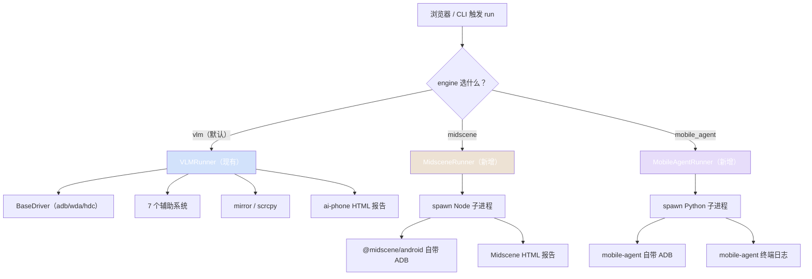
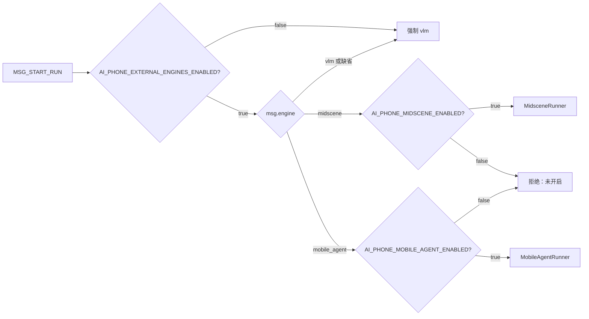

# 执行引擎扩展方案

> 在不动 ai-phone 现有 VLM 主循环和辅助系统的前提下，引入 Midscene、Mobile-Agent 两个独立的外接执行通道，做"对照通道"，不做"替代品"。

---

## 1. 三方能力对比（先看这个）

| 维度 | ai-phone（当前） | Midscene | Mobile-Agent v3 |
|---|---|---|---|
| 设计派别 | 工程治理 + 单 VLM 主循环 | 工程化框架 + 单 agent | **学术派 + 多智能体协作** |
| 过程治理 | 7 个辅助系统 | 缓存 + 报告 | Reflector 反思 + 长期经验记忆 |
| 输入风格 | 自由 / 结构化 case 都吃 | aiAct 自然语言 / instant action | 自然语言 task |
| 工程维护方 | 单人维护 | 字节大厂团队 | 阿里学术团队 |
| 生态语言 | Python | TypeScript / Node | Python |
| iOS 支持 | ✅（自建 WDA 驱动） | ✅（`@midscene/ios`，WDA ≥ 7.0.0） | ❌ |
| Harmony 支持 | ✅（`hmdriver2`） | ❌ | ✅（`--hdc_path`，v3 起支持） |
| 报告 | 自建 timeline + 事件流 | 自带 HTML replay 报告 | 终端日志 + 截图序列 |
| 经济缓存（省 token 计费，**模型仍跑**） | 火山方舟 Responses API 显式 KV 缓存 + 30K 自动分段；实测命中率 82–95%；只依赖请求前缀字节级一致，不依赖真实 UI 环境 | 接入模型时大概率享受底层 KV 缓存，具体实现未公开 | 同上，未公开 |
| 执行缓存（跳过模型直接回放动作） | **暂无**；历史 web 步骤 AI 脚本（`ai_action_merge`）有完整两层缓存方案可借鉴；**严重依赖环境稳定**——页面变了直接点空 | planning + locate 跨 run 缓存；**同样依赖环境稳定**——移动端缓存绝对坐标 + 截图指纹做 invalidation，靠"截图相似度阈值"对冲，扛得住小扰动、扛不住真改版（命中即跳过模型，本质上跟点空风险绑死，只是单步 invalidate 比 case 级清空粒度更细） | Notetaker 长期经验记忆；**机制不同**——命中后模型仍会跑、只是参考历史经验做决策，所以环境敏感度低于前两者，但相应加速幅度也有限 |
| 我们能改吗 | 完全可控 | **不二开**（外部依赖） | **不二开**（外部依赖） |

这张表是整篇文档的出发点：
- 引入这两家不是因为它们更强，而是因为它们走的路完全不一样，能从外部照出 ai-phone 的相对位置。
- "不二开"是我们自己的纪律：外接的就是它的能力，缺什么我们也不补，想要那种能力就回 ai-phone 自己长。

### 1.1 真机基座差异（部署和横评必看）

三家在"怎么连真机"这一层是**完全不复用**的——各自起一套自己的 ADB / WDA / HDC。这正好天然契合本文档"完全隔离、零侵入"的方针，但也带来几条必须提前知道的部署约束：

| 维度 | ai-phone | Midscene | Mobile-Agent-v3 |
|---|---|---|---|
| Android 怎么连 | 自建 `BaseDriver`（ADB）+ scrcpy 镜像服务 | `@midscene/android`，依赖系统 `adb` + `ANDROID_HOME`，**支持远程 adbd**（host/port 可配） | Python 直接调 `adb`，命令行 `--adb_path` 传 |
| Android 文字输入 | 驱动统一接口 | `adb input`；**非 ASCII / 中文走 yadb 兜底** | `adb input`；**必须在被测设备装 ADBKeyboard.apk 并切默认输入法** |
| iOS 怎么连 | 自建 WDA 驱动 | `@midscene/ios`，也用 WDA（**要求 WDA ≥ 7.0.0**，端口 8100） | ❌ |
| Harmony 怎么连 | `hmdriver2` | ❌ | ✅ HDC，命令行 `--hdc_path` |
| 实时镜像（人盯着调） | scrcpy 镜像 + 前端面板 | ❌ 没有，只能事后看 HTML report 截图序列 | ❌ 没有，终端日志 + 截图序列 |
| 设备占用 | 独占 | 独占 | 独占 |

由这张表得出三条**对横评和部署都很关键**的结论：

1. **设备物理独占 → 横评必须串行**
   ADB session、WDA 端口、HDC session 都是排他的，三家不能同时连同一台手机。所以 §11 横评要么"三个引擎依次跑同一台设备"，要么准备同型号设备各一台并行。这条直接影响实验排期。

2. **实时镜像是 ai-phone 的隐性优势**
   外接两家都没有 scrcpy 那种"人盯着回归现场看"的能力，调试 / 演示 / 失败时蹲点只能事后翻报告截图。这点不会出现在成功率指标里，容易被横评数据掩盖，但落地到日常使用体验差异很大，决策时要单独考虑。

3. **被测设备的副作用要做记录**
   - Midscene 走 yadb：被测设备会临时注入一个工具进程
   - Mobile-Agent-v3 走 ADBKeyboard：会把默认输入法改掉，**跑完必须恢复**
   - 两者都要求 ai-phone 自身的设备扫描 / 占用机制不能跟它们抢同一台机器

简言之：真机这一层"各起一套、互不复用"对隔离性是好事，但对设备资源调度提出了"一次只能给一家"的约束。

---

## 2. 背景与目标

### 2.1 现状

ai-phone 当前是单执行引擎架构：

- 一条主链路：`VLMRunner`（`vlm_loop.py`）+ 7 个辅助系统（冷启动 / 通道判定 / 结构化通道 / 审判 / 页面稳定 / 瞬态 UI / finished 断言）
- 所有策略都是单人维护，模型选型、prompt、动作集、过程治理全靠自己长

### 2.2 真实问题

- **单点视野风险**：所有判断和兜底都是基于"一个人对场景的理解"，遇到自己没想到的场景就只能事后补
- **没有横向参照**：现在没办法回答"我做的这一套，比业界主流方案究竟强在哪、弱在哪"
- **改动信心不够**：想动主循环时，没有第二条通道做对照实验，所有改动都是赌

### 2.3 引入第二、三个执行引擎要解决的事

不是替代 VLMRunner，而是建立**两条工程上完全独立的对照通道**：

- 同一条 case，三个引擎都跑一遍，直接看真实差距
- 验证期就一目了然：哪类 case 是 ai-phone 强项，哪类是外部框架强项
- 即便外部框架某天断更或不行了，开关一关就退回今天的现状，零代价

---

## 3. 设计哲学

整个方案的灵魂只有一句：

> **可冗余不可耦合**。

展开成 4 条工程纪律：

### 3.1 完全隔离

外接引擎和 ai-phone 这边**五样东西都不共用**：

- driver（截图 / 点击 / 滑动 / 输入 / 应用控制）
- 截图源
- 真机镜像（mirror）
- 辅助系统（页面稳定 / 瞬态 UI / 审判 / finished 断言）
- 报告（timeline / step / token 统计）

外接引擎自带什么就用什么，缺什么就缺着。

### 3.2 零侵入

- 现有 `vlm_loop.py` 一行不动
- 现有辅助系统一行不动
- 现有 driver / mirror / web 报告链路一行不动
- 删除某个外接引擎的代价 = 删一个目录 + 关一个 env

### 3.3 可关闭

两层开关：

- **env 总开关**：`AI_PHONE_EXTERNAL_ENGINES_ENABLED=false` 时，整套外接逻辑完全不加载，连选项都不出现
- **run 级选项**：浏览器/CLI 触发 run 时显式选 `engine`，默认是 `vlm`（保持现状）

任何时候关掉外接引擎，链路与今天 100% 一致。

### 3.4 不二开

- 外接引擎只用它原生能力跑，**绝不在 ai-phone 这边给它打补丁**
- 它不支持 iOS 就不支持
- 它不支持 Harmony 就不支持
- 它效果不行就关掉
- 想要它的某个能力？请到 ai-phone 自己长，不要去改它

这条纪律保证我们永远不会因为外接框架变成一个新的维护负担。

---

## 4. 同赛道开源框架现状（为什么挑这两家）

2026.04 时间点上，同时满足"语义驱动 + 移动端 + 开源 + 还在维护"的项目其实不多：

| 项目 | 出品 | 是否纳入 | 原因 |
|---|---|---|---|
| **Midscene.js** | 字节 web-infra | ✅ 纳入 | 工程化最强、缓存/报告/CLI 齐全、社区活跃 |
| **Mobile-Agent v3** | 阿里 X-PLUG | ✅ 纳入 | 多智能体协作派别代表，2026.02 仍在更新 |
| AppAgent / AppAgentX | Tencent QQGY | ❌ 不纳入 | 2025.03 后维护变缓；要先做"App 录制建模"才能跑，工程介入成本太重 |
| UI-TARS | 字节 Seed | ❌ 不纳入 | 本质是 VLM 模型而不是框架，已被 Midscene 内嵌为可选 backend，纳入会变成"换模型"而不是"换执行器"，对比维度错了 |
| android-automation-agent | 个人 | ❌ 不纳入 | 个人项目，更新少 |
| Skyvern / Browser Use | 社区 | ❌ 不纳入 | 主战场是 Web，移动端非原生支持 |

挑 Midscene + Mobile-Agent 两家，正好覆盖**两种截然不同的技术哲学**：

- **Midscene = 工程化派**：单 agent 主循环 + 工程化基础设施（缓存、报告、instant action、yaml）
- **Mobile-Agent = 学术派**：多智能体协作（Planner / Decider / Reflector / Notetaker）+ 长期经验记忆

加上 ai-phone 自己的"工程治理派"（单 VLM + 7 辅助系统），三方对照的信号最强。

---

## 5. Midscene 工作方式（决策相关部分）

只挑和这次决策相关的事实，不写营销话术。

### 5.1 模型与视觉路线

- **移动端纯视觉**：Android 走 ADB + 截图，iOS 走 WDA + 截图，**不依赖 DOM/AX**（这一点和 ai-phone 完全一致）
- **VLM 解耦**：通过环境变量配置（Qwen3-VL / Doubao-Seed-Vision / Gemini-3-Pro / UI-TARS / GPT-4o 等），ai-phone 当前用的模型可以直接给它

### 5.2 设备底座

- Android：自带 ADB driver（含 yadb，解决中文输入和 pinch）
- iOS：自带 WDA driver
- HarmonyOS：**官方不支持**

### 5.3 执行 API

| API 类型 | 说明 | 我们这次怎么用 |
|---|---|---|
| `agent.aiAct(prompt)` | 自然语言目标，自动规划 → 执行 → 反思直到完成 | **主用这个**：把 ai-phone 的 goal 全文丢进去就行 |
| `aiTap / aiInput / aiScroll / ...` | Instant Action，AI 只 locate，不规划 | 不用 |
| `aiQuery / aiAssert` | 数据提取 + 断言 | 不用（finished 由它自己判断） |
| `runYaml` | YAML 脚本执行 | 不用 |

### 5.4 工程能力

- **缓存**：planning + locate 缓存，同一条 case 第二次跑 token 和耗时可降一个量级
- **HTML replay 报告**：自动产出 `midscene_run/report/xxx.html`，含截图、AI 推理 JSON、token、时间
- **入口**：JS SDK / CLI / YAML 三种

### 5.5 调用方式

核心 SDK 是 TypeScript/Node，**没有 Python SDK**。ai-phone 这边接入只能起 Node 子进程。

---

## 6. Mobile-Agent v3 工作方式（决策相关部分）

### 6.1 路线特征

和 Midscene 最大的差别：**不是单 agent 主循环，是多智能体协作**。

典型架构（v3 / Mobile-Agent-E）：

- **Planner**：拆解任务、生成步骤计划
- **Decider**：当前页面看到什么、下一步该做什么
- **Reflector**：每步执行后判断是否符合预期，不符合就回滚 / 重规划
- **Notetaker**：把过程中的重要信息（界面布局、操作经验）记进长期记忆库

### 6.2 设备底座

- Android：ADB + ADB Keyboard（中文输入用）
- iOS：**不支持**
- HarmonyOS：**不支持**

### 6.3 执行 API

入口是 Python 脚本：

```python
from mobile_agent_e import inference_agent_E
inference_agent_E(task=goal, device=adb_serial, ...)
```

没有像 Midscene 那种 instant action 的细粒度调用，基本是"丢一个 task 进去等结果"。

### 6.4 工程能力

- 终端日志 + 截图序列，没有自带 HTML 报告
- 长期经验记忆库会跨 run 累积，但是文件存储格式是它自己的，我们不去解读

### 6.5 调用方式

Python 写的，可以直接 `import`。但为了**依赖隔离**（避免它的 transformers / torch 之类大依赖污染 ai-phone 的 venv），仍然用子进程方式启动，依赖装到独立 vendor 目录。

---

## 7. 多引擎并行架构

### 7.1 总图



三条通道之间**没有任何箭头互通**。这就是"完全隔离"的可视化体现。

### 7.2 选型路由



每个外接引擎都有自己的子开关，可以单独启停。

---

## 8. 接入边界（核心约束）

把"接什么 / 不接什么"明明白白列出来，避免后续被悄悄扩展：

| 维度 | 接 | 不接 |
|---|---|---|
| goal 文本 | ✅ 完整透传 | — |
| 设备 serial | ✅ 透传 | — |
| 最终成败结果 | ✅ 收一个 PASS/FAIL/ERROR | — |
| 外接引擎自带报告路径 | ✅ 收一个 URL/路径，给 web 显示链接 | — |
| driver | ❌ | 不共用，外接引擎自己开自己的 ADB |
| 截图源 | ❌ | 不共用 |
| 真机镜像 / scrcpy | ❌ | run 期间 ai-phone 自己的 mirror 主动停掉 |
| 辅助系统 | ❌ | 7 套全都不接管外接引擎 |
| token 统计 | ❌ | 外接引擎的 token 我们不算，它自己日志里有 |
| step 事件流 | ❌ | 外接 run 在 web timeline 上是空的，只有"开始 / 结束 / 报告链接" |
| 瞬态 UI / 页面稳定 | ❌ | 完全不接管，外接引擎效果差就是它的问题 |

这张表写在文档里，是为了将来任何"要不要让辅助系统也覆盖到外接引擎"的提议都能直接被这张表否决。

---

## 9. 接入点设计

### 9.1 入口分流

唯一改动点是 `ai-phone/backend/ai_phone/agent/main.py` 的 `_handle_start_run`：

```
现在：runner = VLMRunner(...)
改成：runner = build_runner(engine, run_id, driver, goal, emit, settings)
```

`build_runner` 是新增工厂函数：

- `engine="vlm"` 或缺省 → 返回 `VLMRunner`（行为完全等价于今天）
- `engine="midscene"` → 返回 `MidsceneRunner`
- `engine="mobile_agent"` → 返回 `MobileAgentRunner`

每个 Runner 都遵守同一个最小协议：

```
async def run(self) -> None: ...   # 跑完通过 emit 上报结束
```

### 9.2 MidsceneRunner（Python 薄壳）

预计 < 200 行，核心逻辑：

1. emit 一个 `RUN_START` 事件
2. **关键**：先停掉该 serial 的 ai-phone mirror（避免 ADB 抢占）
3. spawn `node midscene-bridge/dist/run.js --serial <s> --goal <g>`
4. 等子进程退出，捕获 stdout 里的报告路径和 PASS/FAIL
5. emit 一个 `MIDSCENE_REPORT_READY(url)` 事件
6. emit `RUN_FINISH`

子进程崩溃 / 超时 → 兜底 emit `RUN_FINISH(error)`，不让它把整个 ai-phone 拖死。

### 9.3 Node 适配脚本（独立项目）

新建目录 `ai-phone/midscene-bridge/`：

- 独立 `package.json`，独立 `npm install`
- 单文件 `src/run.ts`：实例化 `@midscene/android` Agent，调 `aiAct(goal)`，把报告路径写到 stdout
- 这个目录**不进** `ai-phone/backend` 的 Python 包，不污染 Python 依赖
- 删除整个目录 = 完全卸载 Midscene 通道

### 9.4 MobileAgentRunner（Python 薄壳）

结构对称 MidsceneRunner，区别只在内部：

- 不用 spawn Node，spawn Python：`python -m mobile_agent_runner --serial <s> --task <g>`
- 这个 `mobile_agent_runner` 是 ai-phone 这边写的一个**入口适配器**，住在 `ai-phone/mobile-agent-bridge/` 目录
- bridge 目录有独立 `requirements.txt`，依赖装到 `ai-phone/mobile-agent-bridge/.venv/` 里
- 目的：mobile-agent 那一坨大依赖（torch / transformers / 它内置的 VLM 客户端）不会污染 ai-phone backend 的 Python 环境

### 9.5 共同协议

无论 Midscene 还是 Mobile-Agent，这一层都向上暴露完全一致的事件格式：

```json
{"type": "RUN_START", "engine": "midscene", "ts": ...}
{"type": "EXTERNAL_REPORT", "engine": "midscene", "url": "...", "ts": ...}
{"type": "RUN_FINISH", "engine": "midscene", "result": "pass|fail|error", "ts": ...}
```

web 端只要识别 `engine != "vlm"` 就把 timeline 区域换成"在新窗口打开外部报告"按钮。

---

## 10. 实施清单

每一步都能独立合入和回滚，任何中间状态都不影响现有 vlm 通道。

### Step 1：占位（半天）

- 加 env 开关：`AI_PHONE_EXTERNAL_ENGINES_ENABLED` / `AI_PHONE_MIDSCENE_ENABLED` / `AI_PHONE_MOBILE_AGENT_ENABLED`
- 在 `_handle_start_run` 里加 `build_runner()` 工厂函数
- `build_runner()` 当前只返回 `VLMRunner`，外接 engine 选项命中时直接返回错误："未实装"
- **此步上线对线上零影响**

### Step 2：Midscene-bridge 独立验证（1-2 天）

- 新建 `ai-phone/midscene-bridge/`，`npm install` Midscene
- 写 `src/run.ts`，命令行手动测试：`node dist/run.js --serial xxx --goal "打开微信"`
- 确认能跑通、能产出报告
- **此步不和 ai-phone 主干联动**

### Step 3：MidsceneRunner 接入（1 天）

- 写 `MidsceneRunner` Python 类
- `build_runner()` 接通 midscene 通道
- web 端先不动，用 CLI 直接派 run 验证

### Step 4：Mobile-Agent-bridge 独立验证（1-2 天）

- 新建 `ai-phone/mobile-agent-bridge/`，独立 venv 装 mobile-agent
- 写 `mobile_agent_runner` 入口，命令行手动测试

### Step 5：MobileAgentRunner 接入（1 天）

- 写 `MobileAgentRunner` Python 类
- `build_runner()` 接通 mobile-agent 通道

### Step 6：Web 触发处加选项（1 天）

- run 触发 UI 增加引擎下拉框（受 env 控制是否显示）
- run 详情页识别 engine != vlm 时显示"打开外部报告"按钮

### Step 7：横评跑批（持续）

- 详见下一节

整个工程量预计 5-7 个工作日，每一步都是独立可发布的。

---

## 11. 验证方案（这是引入外接引擎的真正目的）

### 11.1 横评 case 集

挑 30-50 条覆盖性 case，至少包括：

- 短指令（10 条）：例如"切到通讯录 tab"、"点设置进入 wifi"
- 结构化 case（10 条）：从现有测试库挑代表性、带预期结果的
- 视频 / 瞬态 UI 场景（5 条）：例如"在视频播放中点返回箭头"、"唤起工具栏后切倍速"
- 长流程 case（5 条）：步骤数 ≥ 10 的端到端业务流程
- open_app / 冷启动场景（5 条）：包名匹配相关
- 边缘 case（5 条）：动画过渡、Toast、自动隐藏菜单

### 11.2 同 case 三引擎都跑

每条 case 在每个引擎下跑 3 次（同一 case 同引擎之间留 30s+），记录：

| 指标 | 说明 |
|---|---|
| 成功率 | 3 次中通过几次 |
| 首次成功率 | 第一次就直接 pass 的占比 |
| 平均耗时 | 包括首次（无缓存）和后续（有缓存） |
| 平均 token 成本 | 各引擎自报数，无法的就只记次数 |
| 主要失败模式 | 误识别 / 死循环 / 瞬态错过 / finished 错判 / 其他 |

Mobile-Agent 跑不了 iOS / Harmony case 的，直接标 N/A，不补跑、不偏袒。

### 11.3 执行缓存专项实验

ai-phone 已经把"经济缓存"做到 90% 命中率级别，但**没有"执行缓存"**——每一步都要重新调一次 VLM。Midscene 的核心卖点之一就是 planning + locate 跨 run 缓存（执行缓存）。这两件事在**重复跑同一条 case** 时差距最大，但同时执行缓存严重依赖环境稳定，所以实验必须同时测"加速收益"和"环境扰动失败率"两个面：

**实验 A：稳定环境下的加速比**

| 步骤 | 操作 |
|---|---|
| 1 | 选 5 条"步骤数 ≥ 10 的代表性 case"，每个引擎都跑 1 次（首跑：尚无执行缓存可命中） |
| 2 | 立即用同一引擎再跑同一条 case 5 次（重复跑：Midscene 走 planning/locate 缓存、ai-phone 仍只有经济缓存、Mobile-Agent 看 Notetaker 经验记忆是否激活） |
| 3 | 记录每次的：耗时、step 数、LLM 调用次数、token 消耗、是否成功 |

输出"重复跑加速比"对比表：

```
case_id | ai-phone（首跑/重复跑） | midscene（首跑/重复跑） | mobile-agent（首跑/重复跑） | 备注
        | 耗时 step 调用次数 token | 耗时 step 调用次数 token | 耗时 step 调用次数 token   |
```

**实验 B：UI 扰动下的失败率**（执行缓存的真实风险）

执行缓存等同于"录制回放"，页面动一动就可能直接点空。这条实验专门测它在 UI 不稳时的鲁棒性：

| 步骤 | 操作 |
|---|---|
| 1 | 接着实验 A 的同一条 case，让缓存已经填好 |
| 2 | 人为引入扰动：A. 启动前先让一个干扰弹窗占位再回来；B. 改一处局部布局（同样语义、不同坐标）；C. 注入一段 1–2s 的延时动画 |
| 3 | 再跑 5 次，记录：是否点空 / 点错、是否触发引擎自带的"加载完检测"兜底、最终成功率 |

判定标准（综合两条实验一起看）：

- **加速明显（≥3x） + 扰动下失败率可接受（< 20%）**：执行缓存确实是 ai-phone 当前缺的能力，值得借鉴 web 历史脚本（`ai_action_merge`）的两层 key + use_cache 开关 + case 失败清空 + 加载完检测，自建一套（不二开 Midscene）
- **加速明显但扰动下失败率高（> 50%）**：执行缓存只在"绝对稳定的 demo 环境"有用，业务回归用不上，文档备案"评估完不引入，警惕过度承诺"
- **加速不明显（< 2x）**：ai-phone 的经济缓存（90% 命中 + 自动分段）已经把账单和延迟都压到位了，再叠执行缓存收益有限，文档备案"已评估、不需要"

这个实验的目的是把"是否在 ai-phone 长执行缓存"这件事从"凭直觉"变成"有数据"，并且同步暴露执行缓存的真实代价，避免被单点加速比误导。

### 11.4 输出三方矩阵

最终交付一张大表：

```
case_id | 类别 | ai-phone | midscene | mobile-agent | 备注
        |     | 成功率/耗时/token | ... | ...        |
```

附两张子表：

- **"外接框架比 ai-phone 强的场景"** → 决策：要不要把这些场景的策略思路吸收进 ai-phone
- **"ai-phone 比外接框架强的场景"** → 这就是 ai-phone 的护城河，文档化后就不用再担心"是不是被外面的开源吊打"

### 11.5 决策矩阵

横评跑完后，每个外接引擎做三选一决策：

- **保留双通道**：它在某些场景上确实强，作为生产可选项保留
- **关掉**：横评下来没有比 ai-phone 强的场景，关掉子开关，代码留着备用
- **吸收某特性**：它的某个机制（比如 Midscene 的缓存）确实有价值，**回 ai-phone 自己实现**（不二开外接引擎）

---

## 12. 风险与回退

### 12.1 主要风险

| 风险 | 应对 |
|---|---|
| ADB 抢占（同设备同时被 ai-phone driver 和外接 driver 持有） | 外接 run 启动前强制停掉该 serial 的 mirror；run 期间 ai-phone 不下发任何手动 input；run 结束后镜像可重新启动 |
| Node 子进程崩溃 / 卡死 | MidsceneRunner 设硬超时（默认 30 分钟和 vlm 一致），超时强杀子进程并 emit error |
| Python 依赖污染 | mobile-agent-bridge 独立 venv，绝不进 backend 主 venv |
| 外接框架断更（学术项目尤其） | 锁版本到 git submodule / 锁定 npm 版本号；断更就关子开关 |
| 外接框架的 token 成本不可控 | 子开关默认关闭，只有显式启用的设备才能选；env 里加白名单限制 |
| 外接引擎跑得很烂污染数据库 | run 记录里清楚标 engine 字段，分析时按 engine 切片，不和 vlm 混算成功率 |

### 12.2 一键回滚

任何时间点想回到今天的状态：

```
AI_PHONE_EXTERNAL_ENGINES_ENABLED=false   # 一行 env
```

效果：

- web 不显示引擎选项
- `build_runner()` 永远返回 `VLMRunner`
- midscene-bridge / mobile-agent-bridge 目录留着不影响主干
- 链路与今天 100% 一致

### 12.3 完全卸载

如果要彻底删除某个外接引擎：

```
rm -rf ai-phone/midscene-bridge/
# 或
rm -rf ai-phone/mobile-agent-bridge/
```

加上把 `build_runner()` 里对应分支删掉即可，不会残留任何耦合。

---

## 13. 不做的事（明确边界）

为了防止方案在落地过程中被悄悄扩展，下面这些事**这一期不做、未来也不做**：

- 不实现 ai-phone driver 与外接引擎共用
- 不实现 mirror 给外接引擎复用
- 不让 7 个辅助系统接管外接引擎的过程
- 不接管外接引擎的报告内容（只透传 URL）
- 不解析外接引擎的 step 事件（它日志怎么打就怎么打）
- 不做 router 自动选引擎（永远是显式开关 + 用户选）
- 不为某个外接引擎做 ai-phone 这边的特殊适配
- 不修任何外接引擎的 bug（提 issue 给上游，能修就修，不能修就关）
- 不把外接引擎的能力"封装"成一个 ai-phone API（封装就是耦合）

---

## 14. 总结

这套方案的工程价值不在于"接入了 Midscene / Mobile-Agent"，而在于：

> 用最低的成本，让 ai-phone 第一次有了**可外部对照**的能力。

- 不动核心：现有 VLM 主循环 + 辅助系统一行不改
- 不互相污染：三条通道完全隔离，谁都不影响谁
- 可关可删：一个 env 开关回到今天，删一个目录卸载干净
- 真实信号：横评跑完后，第一次能拿出"我的策略相对业界主流的客观坐标"

它的目的不是把外接引擎"用起来"，而是**用真实数据回答**：

- 我自己维护的这一套，到底强在哪、弱在哪？
- 哪些地方该坚持，哪些地方该学？
- 我现在长辅助系统的方向，和业界整体方向是不是一致？

横评跑完那天，无论结论是什么，ai-phone 的下一步都会变得更稳。

---

## 15. 代码参考点

本方案落地时主要会涉及以下位置：

- 入口分流  
  `ai-phone/backend/ai_phone/agent/main.py` 的 `_handle_start_run`

- Runner 工厂（新增）  
  `ai-phone/backend/ai_phone/agent/runner/factory.py`

- Midscene 适配（新增）  
  `ai-phone/backend/ai_phone/agent/runner/midscene_runner.py`  
  `ai-phone/midscene-bridge/`（独立 Node 项目）

- Mobile-Agent 适配（新增）  
  `ai-phone/backend/ai_phone/agent/runner/mobile_agent_runner.py`  
  `ai-phone/mobile-agent-bridge/`（独立 Python 项目，独立 venv）

- 配置开关  
  `ai-phone/backend/ai_phone/config.py`  
  `ai-phone/backend/.env.example`

- 现有主链路（**只读，不改**）  
  `ai-phone/backend/ai_phone/agent/runner/vlm_loop.py`  
  `ai-phone/backend/ai_phone/agent/drivers/`  
  `ai-phone/backend/ai_phone/shared/prompt.py`
